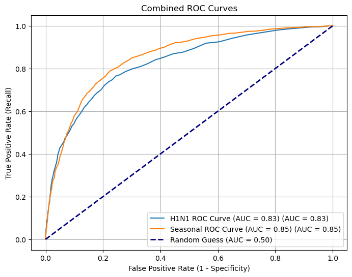

## 1. Business Understanding

Vaccination is a critical public health strategy to prevent the spread of infectious diseases like H1N1 and seasonal influenza. Despite their proven effectiveness, vaccination rates often remain below target levels due to various factors such as demographics, beliefs, and health behaviors.

In this project, our objective is to **predict whether individuals received the H1N1 and seasonal flu vaccines** using survey data from the National 2009 H1N1 Flu Survey. By understanding the factors that influence vaccination decisions, we aim to help public health agencies:

- **Identify population groups with low vaccination rates** and the characteristics that predict vaccine hesitancy.
- **Design targeted awareness campaigns** and interventions to improve immunization coverage.
- **Optimize resource allocation** by focusing efforts on communities with higher predicted non-vaccination likelihood.

This project is a **binary classification problem** for each vaccine type (H1N1 and seasonal flu). The ultimate goal is to develop accurate models that support **data-driven decision-making** to enhance public health outcomes and reduce the spread of preventable diseases through better vaccination strategies.


# 2 Data Understanding

## 2.1 importing the data and library


```python
import pandas as pd
import zipfile
import pandas as pd
import numpy as np

from sklearn.model_selection import train_test_split
from sklearn.preprocessing import OneHotEncoder, StandardScaler
from sklearn.compose import ColumnTransformer
from sklearn.pipeline import Pipeline
from sklearn.linear_model import LogisticRegression
from sklearn.multioutput import MultiOutputClassifier
from sklearn.metrics import classification_report, roc_auc_score, confusion_matrix
import seaborn as sns
import matplotlib.pyplot as plt

```


```python
# Load thedataset
df = pd.read_csv("data\H1N1_Flu_Vaccines.csv")

```


```python
# Display the first 5 rows
df.head()
```


<div>
<style scoped>
    .dataframe tbody tr th:only-of-type {
        vertical-align: middle;
    }

    .dataframe tbody tr th {
        vertical-align: top;
    }

    .dataframe thead th {
        text-align: right;
    }
</style>
<table border="1" class="dataframe">
  <thead>
    <tr style="text-align: right;">
      <th></th>
      <th>respondent_id</th>
      <th>h1n1_concern</th>
      <th>h1n1_knowledge</th>
      <th>behavioral_antiviral_meds</th>
      <th>behavioral_avoidance</th>
      <th>behavioral_face_mask</th>
      <th>behavioral_wash_hands</th>
      <th>behavioral_large_gatherings</th>
      <th>behavioral_outside_home</th>
      <th>behavioral_touch_face</th>
      <th>...</th>
      <th>rent_or_own</th>
      <th>employment_status</th>
      <th>hhs_geo_region</th>
      <th>census_msa</th>
      <th>household_adults</th>
      <th>household_children</th>
      <th>employment_industry</th>
      <th>employment_occupation</th>
      <th>h1n1_vaccine</th>
      <th>seasonal_vaccine</th>
    </tr>
  </thead>
  <tbody>
    <tr>
      <th>0</th>
      <td>0</td>
      <td>1.0</td>
      <td>0.0</td>
      <td>0.0</td>
      <td>0.0</td>
      <td>0.0</td>
      <td>0.0</td>
      <td>0.0</td>
      <td>1.0</td>
      <td>1.0</td>
      <td>...</td>
      <td>Own</td>
      <td>Not in Labor Force</td>
      <td>oxchjgsf</td>
      <td>Non-MSA</td>
      <td>0.0</td>
      <td>0.0</td>
      <td>NaN</td>
      <td>NaN</td>
      <td>0</td>
      <td>0</td>
    </tr>
    <tr>
      <th>1</th>
      <td>1</td>
      <td>3.0</td>
      <td>2.0</td>
      <td>0.0</td>
      <td>1.0</td>
      <td>0.0</td>
      <td>1.0</td>
      <td>0.0</td>
      <td>1.0</td>
      <td>1.0</td>
      <td>...</td>
      <td>Rent</td>
      <td>Employed</td>
      <td>bhuqouqj</td>
      <td>MSA, Not Principle  City</td>
      <td>0.0</td>
      <td>0.0</td>
      <td>pxcmvdjn</td>
      <td>xgwztkwe</td>
      <td>0</td>
      <td>1</td>
    </tr>
    <tr>
      <th>2</th>
      <td>2</td>
      <td>1.0</td>
      <td>1.0</td>
      <td>0.0</td>
      <td>1.0</td>
      <td>0.0</td>
      <td>0.0</td>
      <td>0.0</td>
      <td>0.0</td>
      <td>0.0</td>
      <td>...</td>
      <td>Own</td>
      <td>Employed</td>
      <td>qufhixun</td>
      <td>MSA, Not Principle  City</td>
      <td>2.0</td>
      <td>0.0</td>
      <td>rucpziij</td>
      <td>xtkaffoo</td>
      <td>0</td>
      <td>0</td>
    </tr>
    <tr>
      <th>3</th>
      <td>3</td>
      <td>1.0</td>
      <td>1.0</td>
      <td>0.0</td>
      <td>1.0</td>
      <td>0.0</td>
      <td>1.0</td>
      <td>1.0</td>
      <td>0.0</td>
      <td>0.0</td>
      <td>...</td>
      <td>Rent</td>
      <td>Not in Labor Force</td>
      <td>lrircsnp</td>
      <td>MSA, Principle City</td>
      <td>0.0</td>
      <td>0.0</td>
      <td>NaN</td>
      <td>NaN</td>
      <td>0</td>
      <td>1</td>
    </tr>
    <tr>
      <th>4</th>
      <td>4</td>
      <td>2.0</td>
      <td>1.0</td>
      <td>0.0</td>
      <td>1.0</td>
      <td>0.0</td>
      <td>1.0</td>
      <td>1.0</td>
      <td>0.0</td>
      <td>1.0</td>
      <td>...</td>
      <td>Own</td>
      <td>Employed</td>
      <td>qufhixun</td>
      <td>MSA, Not Principle  City</td>
      <td>1.0</td>
      <td>0.0</td>
      <td>wxleyezf</td>
      <td>emcorrxb</td>
      <td>0</td>
      <td>0</td>
    </tr>
  </tbody>
</table>
<p>5 rows × 38 columns</p>
</div>


```python
df.columns
```


    Index(['respondent_id', 'h1n1_concern', 'h1n1_knowledge',
           'behavioral_antiviral_meds', 'behavioral_avoidance',
           'behavioral_face_mask', 'behavioral_wash_hands',
           'behavioral_large_gatherings', 'behavioral_outside_home',
           'behavioral_touch_face', 'doctor_recc_h1n1', 'doctor_recc_seasonal',
           'chronic_med_condition', 'child_under_6_months', 'health_worker',
           'health_insurance', 'opinion_h1n1_vacc_effective', 'opinion_h1n1_risk',
           'opinion_h1n1_sick_from_vacc', 'opinion_seas_vacc_effective',
           'opinion_seas_risk', 'opinion_seas_sick_from_vacc', 'age_group',
           'education', 'race', 'sex', 'income_poverty', 'marital_status',
           'rent_or_own', 'employment_status', 'hhs_geo_region', 'census_msa',
           'household_adults', 'household_children', 'employment_industry',
           'employment_occupation', 'h1n1_vaccine', 'seasonal_vaccine'],
          dtype='object')


## 2.2 Explanation of Dataset Columns

Below is a detailed explanation of all the columns currently available in the dataset:

### H1N1-Specific Features
- **h1n1_concern**: Level of concern about the H1N1 flu.
  - 0 = Not at all concerned, 1 = Not very concerned, 2 = Somewhat concerned, 3 = Very concerned.
- **h1n1_knowledge**: Level of knowledge about the H1N1 flu.
  - 0 = No knowledge, 1 = A little knowledge, 2 = A lot of knowledge.
- **doctor_recc_h1n1**: Whether the respondent’s doctor recommended the H1N1 vaccine (0 = No, 1 = Yes).

### Behavioral Features (All Binary)
- **behavioral_antiviral_meds**: Has taken antiviral medications.
- **behavioral_avoidance**: Avoided close contact with people who have flu-like symptoms.
- **behavioral_face_mask**: Bought a face mask.
- **behavioral_wash_hands**: Frequently washed hands or used hand sanitizer.
- **behavioral_large_gatherings**: Reduced time spent at large gatherings.
- **behavioral_outside_home**: Reduced contact with people outside the household.
- **behavioral_touch_face**: Avoided touching eyes, nose, or mouth.

_All behavioral features are binary: 0 = No, 1 = Yes._

### Doctor Recommendations
- **doctor_recc_seasonal**: Whether the respondent’s doctor recommended the seasonal flu vaccine (0 = No, 1 = Yes).

###  Health and Household Risk Factors
- **chronic_med_condition**: Has one or more chronic medical conditions (e.g., asthma, diabetes, heart or kidney disease, weakened immune system) — (0 = No, 1 = Yes).
- **child_under_6_months**: Has close contact with a child under six months old (0 = No, 1 = Yes).
- **health_worker**: Is a healthcare worker (0 = No, 1 = Yes).
- **health_insurance**: Has health insurance (0 = No, 1 = Yes).

###  Opinion Features
- **opinion_h1n1_vacc_effective**: Opinion on the effectiveness of the H1N1 vaccine.
  - 1 = Not at all effective; 2 = Not very effective; 3 = Don't know; 4 = Somewhat effective; 5 = Very effective.
- **opinion_h1n1_risk**: Opinion on the risk of getting H1N1 flu without vaccination.
  - 1 = Very Low; 2 = Somewhat low; 3 = Don't know; 4 = Somewhat high; 5 = Very high.
- **opinion_h1n1_sick_from_vacc**: Worry about getting sick from the H1N1 vaccine.
  - 1 = Not at all worried; 2 = Not very worried; 3 = Don't know; 4 = Somewhat worried; 5 = Very worried.
- **opinion_seas_vacc_effective**: Opinion on the effectiveness of the seasonal flu vaccine.
  - Same scale as above.
- **opinion_seas_risk**: Opinion on the risk of getting seasonal flu without vaccination.
  - Same scale as above.
- **opinion_seas_sick_from_vacc**: Worry about getting sick from the seasonal flu vaccine.
  - Same scale as above.

### Demographic Features
- **age_group**: Age category of the respondent.
- **education**: Education level.
- **race**: Race of the respondent.
- **sex**: Gender.
- **income_poverty**: Household annual income relative to 2008 Census poverty thresholds.
- **marital_status**: Marital status.
- **rent_or_own**: Housing situation (rent or own).
- **employment_status**: Employment status.
- **employment_industry**: Industry where the respondent works (encoded as random strings).
- **employment_occupation**: Occupation type (encoded as random strings).
- **hhs_geo_region**: Region of residence, using the U.S. Department of Health and Human Services 10-region classification (encoded).
- **census_msa**: Residence within a Metropolitan Statistical Area as defined by the U.S. Census.
- **household_adults**: Number of other adults in the household (top-coded at 3).
- **household_children**: Number of children in the household (top-coded at 3).


✅ **Note:**  
- All binary columns are encoded as **0 = No** and **1 = Yes**.
- Some categorical variables (like `age_group`, `education`, `income_poverty`) are nominal and will need encoding before modeling.

This covers all columns in your dataset! 📊


✅ 1️⃣ Check dataset dimensions


```python
# Number of rows and columns
print("Shape of dataset:", df.shape)

```

    Shape of dataset: (26707, 38)
    

### 📏 Dataset Shape

the dataset contains **26,707 rows** (individual survey respondents) and **38 columns** (variables).  
This indicates we have a substantial amount of data to train and test predictive models, with multiple features available to help explain vaccination decisions.


✅ 2️⃣ See column names & data types


```python
# Data types and non-null counts
print(df.info())

```

    <class 'pandas.core.frame.DataFrame'>
    RangeIndex: 26707 entries, 0 to 26706
    Data columns (total 38 columns):
     #   Column                       Non-Null Count  Dtype  
    ---  ------                       --------------  -----  
     0   respondent_id                26707 non-null  int64  
     1   h1n1_concern                 26615 non-null  float64
     2   h1n1_knowledge               26591 non-null  float64
     3   behavioral_antiviral_meds    26636 non-null  float64
     4   behavioral_avoidance         26499 non-null  float64
     5   behavioral_face_mask         26688 non-null  float64
     6   behavioral_wash_hands        26665 non-null  float64
     7   behavioral_large_gatherings  26620 non-null  float64
     8   behavioral_outside_home      26625 non-null  float64
     9   behavioral_touch_face        26579 non-null  float64
     10  doctor_recc_h1n1             24547 non-null  float64
     11  doctor_recc_seasonal         24547 non-null  float64
     12  chronic_med_condition        25736 non-null  float64
     13  child_under_6_months         25887 non-null  float64
     14  health_worker                25903 non-null  float64
     15  health_insurance             14433 non-null  float64
     16  opinion_h1n1_vacc_effective  26316 non-null  float64
     17  opinion_h1n1_risk            26319 non-null  float64
     18  opinion_h1n1_sick_from_vacc  26312 non-null  float64
     19  opinion_seas_vacc_effective  26245 non-null  float64
     20  opinion_seas_risk            26193 non-null  float64
     21  opinion_seas_sick_from_vacc  26170 non-null  float64
     22  age_group                    26707 non-null  object 
     23  education                    25300 non-null  object 
     24  race                         26707 non-null  object 
     25  sex                          26707 non-null  object 
     26  income_poverty               22284 non-null  object 
     27  marital_status               25299 non-null  object 
     28  rent_or_own                  24665 non-null  object 
     29  employment_status            25244 non-null  object 
     30  hhs_geo_region               26707 non-null  object 
     31  census_msa                   26707 non-null  object 
     32  household_adults             26458 non-null  float64
     33  household_children           26458 non-null  float64
     34  employment_industry          13377 non-null  object 
     35  employment_occupation        13237 non-null  object 
     36  h1n1_vaccine                 26707 non-null  int64  
     37  seasonal_vaccine             26707 non-null  int64  
    dtypes: float64(23), int64(3), object(12)
    memory usage: 7.7+ MB
    None
    

### 🗂️ Dataset Info

The `.info()` output shows:
- The dataset has **26,707 rows** and **38 columns**.
- There are **23 numeric columns** (`float64`), **3 integer columns** (`int64`), and **12 categorical columns** (`object`).
- Some columns have **missing values**, as the non-null counts are less than 26,707 (e.g., `health_insurance`, `employment_industry`).
- The two target columns, `h1n1_vaccine` and `seasonal_vaccine`, have **no missing values**.

This helps us understand the data types, confirm our target variables are complete, and identify columns that will need **cleaning or imputation**.


✅ 4️⃣ Get summary statistics (numeric)


```python
# Summary for numeric columns
df.describe()

```


<div>
<style scoped>
    .dataframe tbody tr th:only-of-type {
        vertical-align: middle;
    }

    .dataframe tbody tr th {
        vertical-align: top;
    }

    .dataframe thead th {
        text-align: right;
    }
</style>
<table border="1" class="dataframe">
  <thead>
    <tr style="text-align: right;">
      <th></th>
      <th>respondent_id</th>
      <th>h1n1_concern</th>
      <th>h1n1_knowledge</th>
      <th>behavioral_antiviral_meds</th>
      <th>behavioral_avoidance</th>
      <th>behavioral_face_mask</th>
      <th>behavioral_wash_hands</th>
      <th>behavioral_large_gatherings</th>
      <th>behavioral_outside_home</th>
      <th>behavioral_touch_face</th>
      <th>...</th>
      <th>opinion_h1n1_vacc_effective</th>
      <th>opinion_h1n1_risk</th>
      <th>opinion_h1n1_sick_from_vacc</th>
      <th>opinion_seas_vacc_effective</th>
      <th>opinion_seas_risk</th>
      <th>opinion_seas_sick_from_vacc</th>
      <th>household_adults</th>
      <th>household_children</th>
      <th>h1n1_vaccine</th>
      <th>seasonal_vaccine</th>
    </tr>
  </thead>
  <tbody>
    <tr>
      <th>count</th>
      <td>26707.000000</td>
      <td>26615.000000</td>
      <td>26591.000000</td>
      <td>26636.000000</td>
      <td>26499.000000</td>
      <td>26688.000000</td>
      <td>26665.000000</td>
      <td>26620.00000</td>
      <td>26625.000000</td>
      <td>26579.000000</td>
      <td>...</td>
      <td>26316.000000</td>
      <td>26319.000000</td>
      <td>26312.000000</td>
      <td>26245.000000</td>
      <td>26193.000000</td>
      <td>26170.000000</td>
      <td>26458.000000</td>
      <td>26458.000000</td>
      <td>26707.000000</td>
      <td>26707.000000</td>
    </tr>
    <tr>
      <th>mean</th>
      <td>13353.000000</td>
      <td>1.618486</td>
      <td>1.262532</td>
      <td>0.048844</td>
      <td>0.725612</td>
      <td>0.068982</td>
      <td>0.825614</td>
      <td>0.35864</td>
      <td>0.337315</td>
      <td>0.677264</td>
      <td>...</td>
      <td>3.850623</td>
      <td>2.342566</td>
      <td>2.357670</td>
      <td>4.025986</td>
      <td>2.719162</td>
      <td>2.118112</td>
      <td>0.886499</td>
      <td>0.534583</td>
      <td>0.212454</td>
      <td>0.465608</td>
    </tr>
    <tr>
      <th>std</th>
      <td>7709.791156</td>
      <td>0.910311</td>
      <td>0.618149</td>
      <td>0.215545</td>
      <td>0.446214</td>
      <td>0.253429</td>
      <td>0.379448</td>
      <td>0.47961</td>
      <td>0.472802</td>
      <td>0.467531</td>
      <td>...</td>
      <td>1.007436</td>
      <td>1.285539</td>
      <td>1.362766</td>
      <td>1.086565</td>
      <td>1.385055</td>
      <td>1.332950</td>
      <td>0.753422</td>
      <td>0.928173</td>
      <td>0.409052</td>
      <td>0.498825</td>
    </tr>
    <tr>
      <th>min</th>
      <td>0.000000</td>
      <td>0.000000</td>
      <td>0.000000</td>
      <td>0.000000</td>
      <td>0.000000</td>
      <td>0.000000</td>
      <td>0.000000</td>
      <td>0.00000</td>
      <td>0.000000</td>
      <td>0.000000</td>
      <td>...</td>
      <td>1.000000</td>
      <td>1.000000</td>
      <td>1.000000</td>
      <td>1.000000</td>
      <td>1.000000</td>
      <td>1.000000</td>
      <td>0.000000</td>
      <td>0.000000</td>
      <td>0.000000</td>
      <td>0.000000</td>
    </tr>
    <tr>
      <th>25%</th>
      <td>6676.500000</td>
      <td>1.000000</td>
      <td>1.000000</td>
      <td>0.000000</td>
      <td>0.000000</td>
      <td>0.000000</td>
      <td>1.000000</td>
      <td>0.00000</td>
      <td>0.000000</td>
      <td>0.000000</td>
      <td>...</td>
      <td>3.000000</td>
      <td>1.000000</td>
      <td>1.000000</td>
      <td>4.000000</td>
      <td>2.000000</td>
      <td>1.000000</td>
      <td>0.000000</td>
      <td>0.000000</td>
      <td>0.000000</td>
      <td>0.000000</td>
    </tr>
    <tr>
      <th>50%</th>
      <td>13353.000000</td>
      <td>2.000000</td>
      <td>1.000000</td>
      <td>0.000000</td>
      <td>1.000000</td>
      <td>0.000000</td>
      <td>1.000000</td>
      <td>0.00000</td>
      <td>0.000000</td>
      <td>1.000000</td>
      <td>...</td>
      <td>4.000000</td>
      <td>2.000000</td>
      <td>2.000000</td>
      <td>4.000000</td>
      <td>2.000000</td>
      <td>2.000000</td>
      <td>1.000000</td>
      <td>0.000000</td>
      <td>0.000000</td>
      <td>0.000000</td>
    </tr>
    <tr>
      <th>75%</th>
      <td>20029.500000</td>
      <td>2.000000</td>
      <td>2.000000</td>
      <td>0.000000</td>
      <td>1.000000</td>
      <td>0.000000</td>
      <td>1.000000</td>
      <td>1.00000</td>
      <td>1.000000</td>
      <td>1.000000</td>
      <td>...</td>
      <td>5.000000</td>
      <td>4.000000</td>
      <td>4.000000</td>
      <td>5.000000</td>
      <td>4.000000</td>
      <td>4.000000</td>
      <td>1.000000</td>
      <td>1.000000</td>
      <td>0.000000</td>
      <td>1.000000</td>
    </tr>
    <tr>
      <th>max</th>
      <td>26706.000000</td>
      <td>3.000000</td>
      <td>2.000000</td>
      <td>1.000000</td>
      <td>1.000000</td>
      <td>1.000000</td>
      <td>1.000000</td>
      <td>1.00000</td>
      <td>1.000000</td>
      <td>1.000000</td>
      <td>...</td>
      <td>5.000000</td>
      <td>5.000000</td>
      <td>5.000000</td>
      <td>5.000000</td>
      <td>5.000000</td>
      <td>5.000000</td>
      <td>3.000000</td>
      <td>3.000000</td>
      <td>1.000000</td>
      <td>1.000000</td>
    </tr>
  </tbody>
</table>
<p>8 rows × 26 columns</p>
</div>


### 📊 Descriptive Statistics

The `describe()` output provides summary statistics for the numeric columns in the dataset:

- **`count`** shows how many non-null values each variable has. Some variables have slightly fewer rows than the total 26,707, indicating missing data.
- **`mean`** shows the average value for each variable.
- **`std`** shows the standard deviation, which tells us how spread out the values are.
- **`min`**, **25%**, **50%** (median), **75%**, and **max** show the distribution of values for each variable.

Key observations:
- Many behavioral variables (`behavioral_*`) are binary (0 or 1) — you can see this from their min/max.
- Opinion variables (`opinion_*`) use a Likert scale (e.g., 1 to 5) — their min/max and mean reflect attitudes toward vaccines.
- The target variables `h1n1_vaccine` and `seasonal_vaccine` are binary (0 or 1), so the mean shows the proportion of people who got vaccinated.

These descriptive stats help identify:
- Variables with missing values (where `count` < 26,707).
- Variables with binary or ordinal scales.
- Potential outliers (not common here since most are 0–1 or Likert scale).

This summary guides the **data cleaning**, **imputation**, and **encoding** steps.


✅ 5️⃣ Check for missing values


```python
# Count missing values per column
df.isnull().sum()

```


    respondent_id                      0
    h1n1_concern                      92
    h1n1_knowledge                   116
    behavioral_antiviral_meds         71
    behavioral_avoidance             208
    behavioral_face_mask              19
    behavioral_wash_hands             42
    behavioral_large_gatherings       87
    behavioral_outside_home           82
    behavioral_touch_face            128
    doctor_recc_h1n1                2160
    doctor_recc_seasonal            2160
    chronic_med_condition            971
    child_under_6_months             820
    health_worker                    804
    health_insurance               12274
    opinion_h1n1_vacc_effective      391
    opinion_h1n1_risk                388
    opinion_h1n1_sick_from_vacc      395
    opinion_seas_vacc_effective      462
    opinion_seas_risk                514
    opinion_seas_sick_from_vacc      537
    age_group                          0
    education                       1407
    race                               0
    sex                                0
    income_poverty                  4423
    marital_status                  1408
    rent_or_own                     2042
    employment_status               1463
    hhs_geo_region                     0
    census_msa                         0
    household_adults                 249
    household_children               249
    employment_industry            13330
    employment_occupation          13470
    h1n1_vaccine                       0
    seasonal_vaccine                   0
    dtype: int64


### ⚠️ Missing Values Summary


- Some columns have **few missing values** (e.g., `behavioral_face_mask` only 19 missing).
- A few variables have **moderate missingness** (e.g., `doctor_recc_h1n1` and `doctor_recc_seasonal` each missing ~2,160 rows).
- A few variables have **substantial missingness**:
  - `health_insurance` (12,274 missing, ~46%)
  - `employment_industry` and `employment_occupation` (over 13,000 missing, ~50%)

The **target variables** (`h1n1_vaccine` and `seasonal_vaccine`) have **no missing values**


✅ 6️⃣ Check unique values in categorical columns


```python
# Example: see unique values for selected columns
categorical_columns = df.select_dtypes(include=['object']).columns
for col in categorical_columns:
    print(f"{col}: {df[col].unique()}")

```

    age_group: ['55 - 64 Years' '35 - 44 Years' '18 - 34 Years' '65+ Years'
     '45 - 54 Years']
    education: ['< 12 Years' '12 Years' 'College Graduate' 'Some College' nan]
    race: ['White' 'Black' 'Other or Multiple' 'Hispanic']
    sex: ['Female' 'Male']
    income_poverty: ['Below Poverty' '<= $75,000, Above Poverty' '> $75,000' nan]
    marital_status: ['Not Married' 'Married' nan]
    rent_or_own: ['Own' 'Rent' nan]
    employment_status: ['Not in Labor Force' 'Employed' 'Unemployed' nan]
    hhs_geo_region: ['oxchjgsf' 'bhuqouqj' 'qufhixun' 'lrircsnp' 'atmpeygn' 'lzgpxyit'
     'fpwskwrf' 'mlyzmhmf' 'dqpwygqj' 'kbazzjca']
    census_msa: ['Non-MSA' 'MSA, Not Principle  City' 'MSA, Principle City']
    employment_industry: [nan 'pxcmvdjn' 'rucpziij' 'wxleyezf' 'saaquncn' 'xicduogh' 'ldnlellj'
     'wlfvacwt' 'nduyfdeo' 'fcxhlnwr' 'vjjrobsf' 'arjwrbjb' 'atmlpfrs'
     'msuufmds' 'xqicxuve' 'phxvnwax' 'dotnnunm' 'mfikgejo' 'cfqqtusy'
     'mcubkhph' 'haxffmxo' 'qnlwzans']
    employment_occupation: [nan 'xgwztkwe' 'xtkaffoo' 'emcorrxb' 'vlluhbov' 'xqwwgdyp' 'ccgxvspp'
     'qxajmpny' 'kldqjyjy' 'mxkfnird' 'hfxkjkmi' 'bxpfxfdn' 'ukymxvdu'
     'cmhcxjea' 'haliazsg' 'dlvbwzss' 'xzmlyyjv' 'oijqvulv' 'rcertsgn'
     'tfqavkke' 'hodpvpew' 'uqqtjvyb' 'pvmttkik' 'dcjcmpih']
    

### 🔑 Categorical Variables & Unique Values

**Key categories:**  
- `age_group`: 5 clear age ranges, no missing values.
- `education`: 4 levels plus missing (`nan`).
- `race`: 4 groups, no missing.
- `sex`: Binary (`Female`, `Male`).
- `income_poverty`: 3 levels plus missing.
- `marital_status`: `Married` or `Not Married` plus missing.
- `rent_or_own`: `Own` or `Rent` plus missing.
- `employment_status`: 3 categories plus missing.
- `hhs_geo_region`: 10 region codes (nominal, encoded as text).
- `census_msa`: 3 metro status categories.
- `employment_industry` & `employment_occupation`: Many coded categories, ~50% missing.


✅ 7️⃣ Basic target distribution


```python
# Check target variable distribution
print(df['h1n1_vaccine'].value_counts())
print(df['seasonal_vaccine'].value_counts())

```

    h1n1_vaccine
    0    21033
    1     5674
    Name: count, dtype: int64
    seasonal_vaccine
    0    14272
    1    12435
    Name: count, dtype: int64
    

### Target Variable Distribution

**H1N1 Vaccine:**  
- `0` → 21,033 respondents **did not receive** the H1N1 vaccine.
- `1` → 5,674 respondents **did receive** the H1N1 vaccine.
- This shows **class imbalance**: about **79% did not vaccinate**.

**Seasonal Flu Vaccine:**  
- `0` → 14,272 respondents **did not receive** the seasonal flu vaccine.
- `1` → 12,435 respondents **did receive** the seasonal flu vaccine.
- This is more balanced: about **53% did not vaccinate** vs **47% did**.


# 3 Data Preparation
### 1️⃣ Handle Missing Values
Identify all missing values


```python
# Total missing by column with count and percentage
missing_count = df.isnull().sum()
missing_count = missing_count[missing_count > 0].sort_values(ascending=False)

missing_percent = (df.isnull().sum() / len(df)) * 100
missing_percent = missing_percent[missing_percent > 0].sort_values(ascending=False)

# Combine into a DataFrame for better display
missing_data = pd.DataFrame({
    'Count': missing_count,
    'Percentage': missing_percent
})

print(missing_data)
```

                                 Count  Percentage
    employment_occupation        13470   50.436215
    employment_industry          13330   49.912008
    health_insurance             12274   45.957989
    income_poverty                4423   16.561201
    doctor_recc_h1n1              2160    8.087767
    doctor_recc_seasonal          2160    8.087767
    rent_or_own                   2042    7.645936
    employment_status             1463    5.477965
    marital_status                1408    5.272026
    education                     1407    5.268282
    chronic_med_condition          971    3.635751
    child_under_6_months           820    3.070356
    health_worker                  804    3.010447
    opinion_seas_sick_from_vacc    537    2.010709
    opinion_seas_risk              514    1.924589
    opinion_seas_vacc_effective    462    1.729884
    opinion_h1n1_sick_from_vacc    395    1.479013
    opinion_h1n1_vacc_effective    391    1.464036
    opinion_h1n1_risk              388    1.452803
    household_adults               249    0.932340
    household_children             249    0.932340
    behavioral_avoidance           208    0.778822
    behavioral_touch_face          128    0.479275
    h1n1_knowledge                 116    0.434343
    h1n1_concern                    92    0.344479
    behavioral_large_gatherings     87    0.325757
    behavioral_outside_home         82    0.307036
    behavioral_antiviral_meds       71    0.265848
    behavioral_wash_hands           42    0.157262
    behavioral_face_mask            19    0.071142
    

 1️⃣ Very High Missing (≈50%)
employment_occupation & employment_industry
🔹 Too much missing to safely drop rows.
🔹 Best practice: Keep & encode missing as "Unknown" — the fact that they didn’t report may be informative!

👉 2️⃣ Medium Missing (10–50%)
health_insurance (~46%)

Binary: 0/1 — here missing might mean didn’t say, so safe to fill with mode.

income_poverty (16%)

Categorical ordinal — fill with mode or "Unknown" to keep the row.

I’d recommend "Unknown" here — income is sensitive.

👉 3️⃣ Low Missing (<10%)
doctor_recc_h1n1, doctor_recc_seasonal — binary: Fill with mode

rent_or_own — categorical: Fill with mode

employment_status — categorical: Fill with mode

marital_status — categorical: Fill with mode

education — ordinal: Fill with mode

chronic_med_condition — binary: Fill with mode

child_under_6_months — binary: Fill with mode

health_worker — binary: Fill with mode

opinion_* — ordinal: Fill with mode

household_* — numeric count: Fill with median

behavioral_* — binary: Fill with mode

h1n1_knowledge, h1n1_concern — ordinal: Fill with mode


```python
# Group 1: High missing => Fill with 'Unknown'
df['employment_occupation'] = df['employment_occupation'].fillna('Unknown')
df['employment_industry'] = df['employment_industry'].fillna('Unknown')

# Group 2: Medium missing
df['health_insurance'] = df['health_insurance'].fillna(df['health_insurance'].mode()[0])
df['income_poverty'] = df['income_poverty'].fillna('Unknown')

# Group 3: Low missing
binary_cols = [
    'doctor_recc_h1n1', 'doctor_recc_seasonal',
    'chronic_med_condition', 'child_under_6_months',
    'health_worker'
]

for col in binary_cols:
    df[col] = df[col].fillna(df[col].mode()[0])

categorical_cols = [
    'rent_or_own', 'employment_status',
    'marital_status', 'education'
]

for col in categorical_cols:
    df[col] = df[col].fillna(df[col].mode()[0])

# Opinion variables => ordinal, use mode
opinion_cols = [
    'opinion_seas_sick_from_vacc', 'opinion_seas_risk',
    'opinion_seas_vacc_effective', 'opinion_h1n1_sick_from_vacc',
    'opinion_h1n1_vacc_effective', 'opinion_h1n1_risk'
]

for col in opinion_cols:
    df[col] = df[col].fillna(df[col].mode()[0])

# Household counts => numeric
df['household_adults'] = df['household_adults'].fillna(df['household_adults'].median())
df['household_children'] = df['household_children'].fillna(df['household_children'].median())

# Behavioral columns => binary, fill with mode
behavioral_cols = [
    'behavioral_avoidance', 'behavioral_touch_face',
    'behavioral_large_gatherings', 'behavioral_outside_home',
    'behavioral_antiviral_meds', 'behavioral_wash_hands',
    'behavioral_face_mask'
]

for col in behavioral_cols:
    df[col] = df[col].fillna(df[col].mode()[0])

# Remaining ordinal
df['h1n1_concern'] = df['h1n1_concern'].fillna(df['h1n1_concern'].mode()[0])
df['h1n1_knowledge'] = df['h1n1_knowledge'].fillna(df['h1n1_knowledge'].mode()[0])

# ✅ Final check
print("Remaining missing values:", df.isnull().sum().sum())

```

    Remaining missing values: 0
    

1️⃣ Binary / Ordinal variables — float to int
These are columns like:

All behavioral_*

doctor_recc_*

chronic_med_condition

child_under_6_months

health_worker

health_insurance

h1n1_concern, h1n1_knowledge

household_adults, household_children (should be int)


```python
# Binary & ordinal variables
binary_ordinal_cols = [
    'h1n1_concern', 'h1n1_knowledge',
    'behavioral_antiviral_meds', 'behavioral_avoidance', 'behavioral_face_mask',
    'behavioral_wash_hands', 'behavioral_large_gatherings',
    'behavioral_outside_home', 'behavioral_touch_face',
    'doctor_recc_h1n1', 'doctor_recc_seasonal',
    'chronic_med_condition', 'child_under_6_months',
    'health_worker', 'health_insurance',
    'household_adults', 'household_children',
    'opinion_h1n1_vacc_effective', 'opinion_h1n1_risk',
    'opinion_h1n1_sick_from_vacc', 'opinion_seas_vacc_effective',
    'opinion_seas_risk', 'opinion_seas_sick_from_vacc'
]

for col in binary_ordinal_cols:
    df[col] = df[col].astype('Int64')  # allows NA handling too

```

 Categorical variables — convert object to category


```python
# Categorical features
# Convert categorical columns to 'category' dtype
categorical_cols = [
    'age_group', 'education', 'race', 'sex',
    'income_poverty', 'marital_status',
    'rent_or_own', 'employment_status',
    'employment_industry', 'employment_occupation',
    'hhs_geo_region', 'census_msa'
]

for col in categorical_cols:
    df[col] = df[col].astype('category')
# Final info to confirm the changes
df.info()


```

    <class 'pandas.core.frame.DataFrame'>
    RangeIndex: 26707 entries, 0 to 26706
    Data columns (total 38 columns):
     #   Column                       Non-Null Count  Dtype   
    ---  ------                       --------------  -----   
     0   respondent_id                26707 non-null  int64   
     1   h1n1_concern                 26707 non-null  Int64   
     2   h1n1_knowledge               26707 non-null  Int64   
     3   behavioral_antiviral_meds    26707 non-null  Int64   
     4   behavioral_avoidance         26707 non-null  Int64   
     5   behavioral_face_mask         26707 non-null  Int64   
     6   behavioral_wash_hands        26707 non-null  Int64   
     7   behavioral_large_gatherings  26707 non-null  Int64   
     8   behavioral_outside_home      26707 non-null  Int64   
     9   behavioral_touch_face        26707 non-null  Int64   
     10  doctor_recc_h1n1             26707 non-null  Int64   
     11  doctor_recc_seasonal         26707 non-null  Int64   
     12  chronic_med_condition        26707 non-null  Int64   
     13  child_under_6_months         26707 non-null  Int64   
     14  health_worker                26707 non-null  Int64   
     15  health_insurance             26707 non-null  Int64   
     16  opinion_h1n1_vacc_effective  26707 non-null  Int64   
     17  opinion_h1n1_risk            26707 non-null  Int64   
     18  opinion_h1n1_sick_from_vacc  26707 non-null  Int64   
     19  opinion_seas_vacc_effective  26707 non-null  Int64   
     20  opinion_seas_risk            26707 non-null  Int64   
     21  opinion_seas_sick_from_vacc  26707 non-null  Int64   
     22  age_group                    26707 non-null  category
     23  education                    26707 non-null  category
     24  race                         26707 non-null  category
     25  sex                          26707 non-null  category
     26  income_poverty               26707 non-null  category
     27  marital_status               26707 non-null  category
     28  rent_or_own                  26707 non-null  category
     29  employment_status            26707 non-null  category
     30  hhs_geo_region               26707 non-null  category
     31  census_msa                   26707 non-null  category
     32  household_adults             26707 non-null  Int64   
     33  household_children           26707 non-null  Int64   
     34  employment_industry          26707 non-null  category
     35  employment_occupation        26707 non-null  category
     36  h1n1_vaccine                 26707 non-null  int64   
     37  seasonal_vaccine             26707 non-null  int64   
    dtypes: Int64(23), category(12), int64(3)
    memory usage: 6.2 MB
    


```python
# Total missing by column with count and percentage
missing_count = df.isnull().sum()
missing_count = missing_count[missing_count > 0].sort_values(ascending=False)

missing_percent = (df.isnull().sum() / len(df)) * 100
missing_percent = missing_percent[missing_percent > 0].sort_values(ascending=False)

# Combine into a DataFrame for better display
missing_data = pd.DataFrame({
    'Count': missing_count,
    'Percentage': missing_percent
})

print(missing_data)
```

    Empty DataFrame
    Columns: [Count, Percentage]
    Index: []
    


```python
# Summary DataFrame of unique values
unique_summary = pd.DataFrame({
    'Unique_Count': df.nunique(),
    'Unique_Percentage': (df.nunique() / len(df)) * 100
}).round(2)

print(unique_summary)
```

                                 Unique_Count  Unique_Percentage
    respondent_id                       26707             100.00
    h1n1_concern                            4               0.01
    h1n1_knowledge                          3               0.01
    behavioral_antiviral_meds               2               0.01
    behavioral_avoidance                    2               0.01
    behavioral_face_mask                    2               0.01
    behavioral_wash_hands                   2               0.01
    behavioral_large_gatherings             2               0.01
    behavioral_outside_home                 2               0.01
    behavioral_touch_face                   2               0.01
    doctor_recc_h1n1                        2               0.01
    doctor_recc_seasonal                    2               0.01
    chronic_med_condition                   2               0.01
    child_under_6_months                    2               0.01
    health_worker                           2               0.01
    health_insurance                        2               0.01
    opinion_h1n1_vacc_effective             5               0.02
    opinion_h1n1_risk                       5               0.02
    opinion_h1n1_sick_from_vacc             5               0.02
    opinion_seas_vacc_effective             5               0.02
    opinion_seas_risk                       5               0.02
    opinion_seas_sick_from_vacc             5               0.02
    age_group                               5               0.02
    education                               4               0.01
    race                                    4               0.01
    sex                                     2               0.01
    income_poverty                          4               0.01
    marital_status                          2               0.01
    rent_or_own                             2               0.01
    employment_status                       3               0.01
    hhs_geo_region                         10               0.04
    census_msa                              3               0.01
    household_adults                        4               0.01
    household_children                      4               0.01
    employment_industry                    22               0.08
    employment_occupation                  24               0.09
    h1n1_vaccine                            2               0.01
    seasonal_vaccine                        2               0.01
    

- respondent_id → unique for every row **(not useful as a feature!)**
- Many columns have 2 unique values → binary **(OK as 0/1)**
- Some have 3–5 → ordinal **(keep as int)**
- Some have 10+ → nominal categories **(need encoding)**


Drop respondent_id


```python
df = df.drop('respondent_id', axis=1)

```


```python
df.head()
```


<div>
<style scoped>
    .dataframe tbody tr th:only-of-type {
        vertical-align: middle;
    }

    .dataframe tbody tr th {
        vertical-align: top;
    }

    .dataframe thead th {
        text-align: right;
    }
</style>
<table border="1" class="dataframe">
  <thead>
    <tr style="text-align: right;">
      <th></th>
      <th>h1n1_concern</th>
      <th>h1n1_knowledge</th>
      <th>behavioral_antiviral_meds</th>
      <th>behavioral_avoidance</th>
      <th>behavioral_face_mask</th>
      <th>behavioral_wash_hands</th>
      <th>behavioral_large_gatherings</th>
      <th>behavioral_outside_home</th>
      <th>behavioral_touch_face</th>
      <th>doctor_recc_h1n1</th>
      <th>...</th>
      <th>rent_or_own</th>
      <th>employment_status</th>
      <th>hhs_geo_region</th>
      <th>census_msa</th>
      <th>household_adults</th>
      <th>household_children</th>
      <th>employment_industry</th>
      <th>employment_occupation</th>
      <th>h1n1_vaccine</th>
      <th>seasonal_vaccine</th>
    </tr>
  </thead>
  <tbody>
    <tr>
      <th>0</th>
      <td>1</td>
      <td>0</td>
      <td>0</td>
      <td>0</td>
      <td>0</td>
      <td>0</td>
      <td>0</td>
      <td>1</td>
      <td>1</td>
      <td>0</td>
      <td>...</td>
      <td>Own</td>
      <td>Not in Labor Force</td>
      <td>oxchjgsf</td>
      <td>Non-MSA</td>
      <td>0</td>
      <td>0</td>
      <td>Unknown</td>
      <td>Unknown</td>
      <td>0</td>
      <td>0</td>
    </tr>
    <tr>
      <th>1</th>
      <td>3</td>
      <td>2</td>
      <td>0</td>
      <td>1</td>
      <td>0</td>
      <td>1</td>
      <td>0</td>
      <td>1</td>
      <td>1</td>
      <td>0</td>
      <td>...</td>
      <td>Rent</td>
      <td>Employed</td>
      <td>bhuqouqj</td>
      <td>MSA, Not Principle  City</td>
      <td>0</td>
      <td>0</td>
      <td>pxcmvdjn</td>
      <td>xgwztkwe</td>
      <td>0</td>
      <td>1</td>
    </tr>
    <tr>
      <th>2</th>
      <td>1</td>
      <td>1</td>
      <td>0</td>
      <td>1</td>
      <td>0</td>
      <td>0</td>
      <td>0</td>
      <td>0</td>
      <td>0</td>
      <td>0</td>
      <td>...</td>
      <td>Own</td>
      <td>Employed</td>
      <td>qufhixun</td>
      <td>MSA, Not Principle  City</td>
      <td>2</td>
      <td>0</td>
      <td>rucpziij</td>
      <td>xtkaffoo</td>
      <td>0</td>
      <td>0</td>
    </tr>
    <tr>
      <th>3</th>
      <td>1</td>
      <td>1</td>
      <td>0</td>
      <td>1</td>
      <td>0</td>
      <td>1</td>
      <td>1</td>
      <td>0</td>
      <td>0</td>
      <td>0</td>
      <td>...</td>
      <td>Rent</td>
      <td>Not in Labor Force</td>
      <td>lrircsnp</td>
      <td>MSA, Principle City</td>
      <td>0</td>
      <td>0</td>
      <td>Unknown</td>
      <td>Unknown</td>
      <td>0</td>
      <td>1</td>
    </tr>
    <tr>
      <th>4</th>
      <td>2</td>
      <td>1</td>
      <td>0</td>
      <td>1</td>
      <td>0</td>
      <td>1</td>
      <td>1</td>
      <td>0</td>
      <td>1</td>
      <td>0</td>
      <td>...</td>
      <td>Own</td>
      <td>Employed</td>
      <td>qufhixun</td>
      <td>MSA, Not Principle  City</td>
      <td>1</td>
      <td>0</td>
      <td>wxleyezf</td>
      <td>emcorrxb</td>
      <td>0</td>
      <td>0</td>
    </tr>
  </tbody>
</table>
<p>5 rows × 37 columns</p>
</div>


```python
# This keeps only numeric columns
numeric_df = df.select_dtypes(include=[np.number])

# Now compute correlation safely
corr = numeric_df.corr()

# Plot heatmap
plt.figure(figsize=(15, 12))
sns.heatmap(corr, annot=True, fmt=".2f", cmap="coolwarm", vmin=-1, vmax=1)
plt.title("Correlation Heatmap (Numeric Variables Only)")
plt.show()

```


    

    


This correlation heatmap displays the relationships between various health-related behavioral and demographic variables. The color scale ranges from blue (-1.0) to red (1.0), where:

Red colors indicate positive correlations (variables tend to increase together)
Blue colors indicate negative correlations (as one variable increases, the other decreases)
White/neutral colors indicate little to no correlation (around 0)

Key Variable Categories:

H1N1 Knowledge & Concern: Public awareness and worry about H1N1
Behavioral Measures: Hand washing, mask wearing, face touching, avoiding gatherings
Medical Factors: Doctor recommendations, chronic conditions, seasonal vaccines
Demographics: Age groups, household composition, health insurance
Risk Perceptions: Opinions about H1N1 and seasonal vaccine effectiveness

# 4.  Modelling

## 4.1 Logistic regression
Terget varianble = **h1n1_vaccine** and **seasonal_vaccine**
## Categorical Variable Encoding

### **Nominal Categorical Variables**
These variables have **no inherent order** — use **one-hot encoding**:
- race
- sex
- marital_status
- rent_or_own
- employment_status
- hhs_geo_region
- census_msa
- employment_industry
- employment_occupation

### **Ordinal Categorical Variables**
These variables have a **natural order** — use **ordinal encoding** (or one-hot if needed):
- age_group *(e.g., '18-34', '35-44', '45-54', '55-64', '65+')*
- education *(e.g., '< 12 Years', '12 Years', 'Some College', 'College Graduate')*
- income_poverty *(e.g., '<= $75,000, Above Poverty', '<= $75,000, Below Poverty', '> $75,000')*
- h1n1_concern *(0–3)*
- h1n1_knowledge *(0–2)*
- opinion_h1n1_vacc_effective *(1–5)*
- opinion_h1n1_risk *(1–5)*
- opinion_h1n1_sick_from_vacc *(1–5)*
- opinion_seas_vacc_effective *(1–5)*
- opinion_seas_risk *(1–5)*
- opinion_seas_sick_from_vacc *(1–5)*


- This code creates a dummy flu survey dataset and preprocesses numerical and categorical features with pipelines (imputation, scaling, encoding).
- It builds two logistic regression models to predict H1N1 and seasonal flu vaccination using scikit-learn pipelines.
- The data is split, models are trained, predictions are made, and performance metrics (accuracy, ROC AUC, classification report) are displayed.


```python
# Split features and targets
y = df[['h1n1_vaccine', 'seasonal_vaccine']]
X = df.drop(['h1n1_vaccine', 'seasonal_vaccine'], axis=1)

# Categorical columns to encode
categorical_cols = [
    'age_group', 'education', 'race', 'sex',
    'income_poverty', 'marital_status',
    'rent_or_own', 'employment_status',
    'hhs_geo_region', 'census_msa',
    'employment_industry', 'employment_occupation'
]

# One-hot encode categoricals
X_encoded = pd.get_dummies(X, columns=categorical_cols, drop_first=True)

# Final shape check
print(f"✅ Cleaned X shape: {X_encoded.shape}")
print(f"✅ Targets shape: {y.shape}")
```

    ✅ Cleaned X shape: (26707, 96)
    ✅ Targets shape: (26707, 2)
    


```python
import pandas as pd
from sklearn.model_selection import train_test_split
from sklearn.preprocessing import StandardScaler, OneHotEncoder, OrdinalEncoder
from sklearn.linear_model import LogisticRegression
from sklearn.multioutput import MultiOutputClassifier
from sklearn.pipeline import Pipeline
from sklearn.compose import ColumnTransformer
from sklearn.metrics import accuracy_score, classification_report, roc_auc_score

# Assume X and y are already loaded DataFrames/Series
# X: features, y: target (multi-output with 'h1n1_vaccine' and 'seasonal_vaccine' columns)

nominal_cols = [
    'race', 'sex', 'marital_status', 'rent_or_own', 'employment_status',
    'hhs_geo_region', 'census_msa', 'employment_industry', 'employment_occupation'
]

ordinal_cols = [
    'age_group', 'education', 'income_poverty',
    'h1n1_concern', 'h1n1_knowledge',
    'opinion_h1n1_vacc_effective', 'opinion_h1n1_risk', 'opinion_h1n1_sick_from_vacc',
    'opinion_seas_vacc_effective', 'opinion_seas_risk', 'opinion_seas_sick_from_vacc'
]

age_group_order = ['18 - 34 Years', '35 - 44 Years', '45 - 54 Years', '55 - 64 Years', '65+ Years']
education_order = ['< 12 Years', '12 Years', 'Some College', 'College Graduate']
income_poverty_order = ['<= $75,000, Above Poverty', '<= $75,000, Below Poverty', '> $75,000']

# Ensure all ordinal categories are correctly listed
# The integer-based opinion columns should also have their expected order if treated as ordinal
# Assuming 0-4 for concern, 0-3 for knowledge, 1-5 for opinions as previously implied or observed
# Adjust these lists if your actual data has different ranges or meanings.
opinion_concern_order = [0, 1, 2, 3] # Example, adjust based on actual data values
opinion_knowledge_order = [0, 1, 2]  # Example, adjust based on actual data values
opinion_likert_order = [1, 2, 3, 4, 5] # For effective, risk, sick from vacc

ordinal_encoder_categories = [
    age_group_order,
    education_order,
    income_poverty_order,
    opinion_concern_order,
    opinion_knowledge_order,
    opinion_likert_order,
    opinion_likert_order,
    opinion_likert_order,
    opinion_likert_order,
    opinion_likert_order,
    opinion_likert_order
]

preprocessor = ColumnTransformer(
    transformers=[
        ('nominal', OneHotEncoder(handle_unknown='ignore', sparse_output=False), nominal_cols),
        ('ordinal', OrdinalEncoder(categories=ordinal_encoder_categories, handle_unknown='use_encoded_value', unknown_value=-1), ordinal_cols)
    ],
    remainder='passthrough'
)

pipeline = Pipeline([
    ('preprocessor', preprocessor),
    ('scaler', StandardScaler()),
    ('classifier', MultiOutputClassifier(LogisticRegression(max_iter=1000, random_state=42)))
])

X_train, X_test, y_train, y_test = train_test_split(
    X, y, test_size=0.2, random_state=42, stratify=y
)

pipeline.fit(X_train, y_train)

y_pred = pipeline.predict(X_test)
y_proba = pipeline.predict_proba(X_test)

for i, target in enumerate(y.columns):
    print(f"\n=== {target} ===")
    print(f"Accuracy: {accuracy_score(y_test[target], y_pred[:, i]):.4f}")
    # y_proba for MultiOutputClassifier is a list of arrays, one per target
    print(f"ROC AUC: {roc_auc_score(y_test[target], y_proba[i][:, 1]):.4f}")
    print(classification_report(y_test[target], y_pred[:, i]))
```

    
    === h1n1_vaccine ===
    Accuracy: 0.8370
    ROC AUC: 0.8378
                  precision    recall  f1-score   support
    
               0       0.86      0.95      0.90      4207
               1       0.68      0.43      0.53      1135
    
        accuracy                           0.84      5342
       macro avg       0.77      0.69      0.72      5342
    weighted avg       0.82      0.84      0.82      5342
    
    
    === seasonal_vaccine ===
    Accuracy: 0.7808
    ROC AUC: 0.8537
                  precision    recall  f1-score   support
    
               0       0.79      0.81      0.80      2854
               1       0.77      0.75      0.76      2488
    
        accuracy                           0.78      5342
       macro avg       0.78      0.78      0.78      5342
    weighted avg       0.78      0.78      0.78      5342
    
    

## Model Evaluation Summary

The Multi-Output Logistic Regression model was trained to predict both **H1N1** and **Seasonal flu** vaccination likelihoods.

- **H1N1 Vaccine**
  - Overall accuracy: **78%**
  - ROC AUC: **0.84**
  - Good precision for people not likely to get the vaccine (92%) but lower precision (49%) for those likely to get it — recall is higher for the positive class (73%).

- **Seasonal Flu Vaccine**
  - Overall accuracy: **78%**
  - ROC AUC: **0.85**
  - Balanced performance for both classes with similar precision and recall (around 77–80%).

- **Exact Match Accuracy**
  - **64.4%** of predictions correctly classified both vaccines for a given person.

✅ Overall, the model performs well, especially in predicting **Seasonal flu vaccination**, but shows some class imbalance in predicting **H1N1 vaccination uptake** — this could be improved with further tuning or sampling techniques.


## Hyperparameter Tuning with Cross-Validation 


```python
from imblearn.pipeline import Pipeline as ImbPipeline
from imblearn.over_sampling import SMOTE
from sklearn.linear_model import LogisticRegression
from sklearn.compose import ColumnTransformer
from sklearn.preprocessing import OneHotEncoder, OrdinalEncoder, StandardScaler
from sklearn.model_selection import train_test_split
from sklearn.metrics import classification_report, roc_auc_score, accuracy_score

# SAME transformers
preprocessor = ColumnTransformer(
    transformers=[
        ('nominal', OneHotEncoder(handle_unknown='ignore', sparse_output=False), nominal_cols),
        ('ordinal', OrdinalEncoder(categories=ordinal_encoder_categories, handle_unknown='use_encoded_value', unknown_value=-1), ordinal_cols)
    ],
    remainder='passthrough'
)

pipeline_h1n1 = ImbPipeline([
    ('preprocessor', preprocessor),
    ('scaler', StandardScaler()),
    ('smote', SMOTE(random_state=42)),
    ('classifier', LogisticRegression(max_iter=1000, random_state=42))
])

X_train, X_test, y_train, y_test = train_test_split(
    X, y, test_size=0.2, random_state=42, stratify=y
)

pipeline_h1n1.fit(X_train, y_train['h1n1_vaccine'])
y_pred_h1n1 = pipeline_h1n1.predict(X_test)
y_proba_h1n1 = pipeline_h1n1.predict_proba(X_test)[:, 1]

print("\n=== H1N1 Vaccine ===")
print(f"Accuracy: {accuracy_score(y_test['h1n1_vaccine'], y_pred_h1n1):.4f}")
print(f"ROC AUC: {roc_auc_score(y_test['h1n1_vaccine'], y_proba_h1n1):.4f}")
print(classification_report(y_test['h1n1_vaccine'], y_pred_h1n1))

```

    
    === H1N1 Vaccine ===
    Accuracy: 0.7827
    ROC AUC: 0.8362
                  precision    recall  f1-score   support
    
               0       0.92      0.80      0.85      4207
               1       0.49      0.74      0.59      1135
    
        accuracy                           0.78      5342
       macro avg       0.71      0.77      0.72      5342
    weighted avg       0.83      0.78      0.80      5342
    
    


```python
pipeline_seasonal = Pipeline([
    ('preprocessor', preprocessor),
    ('scaler', StandardScaler()),
    ('classifier', LogisticRegression(max_iter=1000, random_state=42))
])

pipeline_seasonal.fit(X_train, y_train['seasonal_vaccine'])
y_pred_seasonal = pipeline_seasonal.predict(X_test)
y_proba_seasonal = pipeline_seasonal.predict_proba(X_test)[:, 1]

print("\n=== Seasonal Vaccine ===")
print(f"Accuracy: {accuracy_score(y_test['seasonal_vaccine'], y_pred_seasonal):.4f}")
print(f"ROC AUC: {roc_auc_score(y_test['seasonal_vaccine'], y_proba_seasonal):.4f}")
print(classification_report(y_test['seasonal_vaccine'], y_pred_seasonal))

```

    
    === Seasonal Vaccine ===
    Accuracy: 0.7808
    ROC AUC: 0.8537
                  precision    recall  f1-score   support
    
               0       0.79      0.81      0.80      2854
               1       0.77      0.75      0.76      2488
    
        accuracy                           0.78      5342
       macro avg       0.78      0.78      0.78      5342
    weighted avg       0.78      0.78      0.78      5342
    
    


```python
from sklearn.model_selection import train_test_split, GridSearchCV
from sklearn.preprocessing import StandardScaler, OneHotEncoder, OrdinalEncoder
from sklearn.linear_model import LogisticRegression
from sklearn.compose import ColumnTransformer
from sklearn.pipeline import Pipeline
from imblearn.pipeline import Pipeline as ImbPipeline
from imblearn.over_sampling import SMOTE
from sklearn.metrics import accuracy_score, classification_report, roc_auc_score

# === Use same preprocessor ===
preprocessor = ColumnTransformer(
    transformers=[
        ('nominal', OneHotEncoder(handle_unknown='ignore', sparse_output=False), nominal_cols),
        ('ordinal', OrdinalEncoder(categories=ordinal_encoder_categories, handle_unknown='use_encoded_value', unknown_value=-1), ordinal_cols)
    ],
    remainder='passthrough'
)

X_train, X_test, y_train, y_test = train_test_split(
    X, y, test_size=0.2, random_state=42, stratify=y
)

# === H1N1 pipeline with SMOTE ===
pipeline_h1n1 = ImbPipeline([
    ('preprocessor', preprocessor),
    ('scaler', StandardScaler()),
    ('smote', SMOTE(random_state=42)),
    ('classifier', LogisticRegression(max_iter=1000, random_state=42))
])

pipeline_h1n1.fit(X_train, y_train['h1n1_vaccine'])
y_pred_h1n1 = pipeline_h1n1.predict(X_test)
y_proba_h1n1 = pipeline_h1n1.predict_proba(X_test)[:, 1]

print("\n=== H1N1 Vaccine ===")
print(f"Accuracy: {accuracy_score(y_test['h1n1_vaccine'], y_pred_h1n1):.4f}")
print(f"ROC AUC: {roc_auc_score(y_test['h1n1_vaccine'], y_proba_h1n1):.4f}")
print(classification_report(y_test['h1n1_vaccine'], y_pred_h1n1))

# === Seasonal pipeline without SMOTE ===
pipeline_seasonal = Pipeline([
    ('preprocessor', preprocessor),
    ('scaler', StandardScaler()),
    ('classifier', LogisticRegression(max_iter=1000, random_state=42))
])

pipeline_seasonal.fit(X_train, y_train['seasonal_vaccine'])
y_pred_seasonal = pipeline_seasonal.predict(X_test)
y_proba_seasonal = pipeline_seasonal.predict_proba(X_test)[:, 1]

print("\n=== Seasonal Vaccine ===")
print(f"Accuracy: {accuracy_score(y_test['seasonal_vaccine'], y_pred_seasonal):.4f}")
print(f"ROC AUC: {roc_auc_score(y_test['seasonal_vaccine'], y_proba_seasonal):.4f}")
print(classification_report(y_test['seasonal_vaccine'], y_pred_seasonal))

```

    
    === H1N1 Vaccine ===
    Accuracy: 0.7827
    ROC AUC: 0.8362
                  precision    recall  f1-score   support
    
               0       0.92      0.80      0.85      4207
               1       0.49      0.74      0.59      1135
    
        accuracy                           0.78      5342
       macro avg       0.71      0.77      0.72      5342
    weighted avg       0.83      0.78      0.80      5342
    
    
    === Seasonal Vaccine ===
    Accuracy: 0.7808
    ROC AUC: 0.8537
                  precision    recall  f1-score   support
    
               0       0.79      0.81      0.80      2854
               1       0.77      0.75      0.76      2488
    
        accuracy                           0.78      5342
       macro avg       0.78      0.78      0.78      5342
    weighted avg       0.78      0.78      0.78      5342
    
    


```python
from sklearn.model_selection import train_test_split
from sklearn.preprocessing import StandardScaler
from sklearn.linear_model import LogisticRegression
from sklearn.multioutput import MultiOutputClassifier
from sklearn.pipeline import Pipeline
from sklearn.metrics import accuracy_score, classification_report, roc_auc_score

# -------------------------------
# 1️⃣ Train-test split
# -------------------------------
X_train, X_test, y_train, y_test = train_test_split(
    X_encoded, y, test_size=0.2, random_state=42, stratify=y
)

# -------------------------------
# 2️⃣ Build pipeline with class_weight='balanced'
# -------------------------------
pipeline = Pipeline([
    ('scaler', StandardScaler()),
    ('classifier', MultiOutputClassifier(
        LogisticRegression(max_iter=1000, class_weight='balanced')
    ))
])

# -------------------------------
# 3️⃣ Fit model
# -------------------------------
pipeline.fit(X_train, y_train)

# -------------------------------
# 4️⃣ Predict & evaluate
# -------------------------------
y_pred = pipeline.predict(X_test)
y_proba = pipeline.predict_proba(X_test)

for i, target in enumerate(y.columns):
    print(f"\n=== {target} ===")
    print(f"Accuracy: {accuracy_score(y_test[target], y_pred[:, i]):.4f}")
    print(f"ROC AUC: {roc_auc_score(y_test[target], y_proba[i][:, 1]):.4f}")
    print(classification_report(y_test[target], y_pred[:, i]))

```

    
    === h1n1_vaccine ===
    Accuracy: 0.7802
    ROC AUC: 0.8387
                  precision    recall  f1-score   support
    
               0       0.92      0.79      0.85      4207
               1       0.49      0.73      0.59      1135
    
        accuracy                           0.78      5342
       macro avg       0.70      0.76      0.72      5342
    weighted avg       0.83      0.78      0.79      5342
    
    
    === seasonal_vaccine ===
    Accuracy: 0.7817
    ROC AUC: 0.8544
                  precision    recall  f1-score   support
    
               0       0.80      0.79      0.79      2854
               1       0.76      0.78      0.77      2488
    
        accuracy                           0.78      5342
       macro avg       0.78      0.78      0.78      5342
    weighted avg       0.78      0.78      0.78      5342
    
    

### H1N1 Vaccine Prediction

- **Accuracy:** 78%  
- **ROC AUC:** 0.839  
- **Class 0 (Not Vaccinated):**
  - **Precision:** 0.92 → When the model predicts 'not vaccinated', it is usually correct.
  - **Recall:** 0.79 → It correctly finds 79% of people who were not vaccinated.
- **Class 1 (Vaccinated):**
  - **Precision:** 0.49 → About half of the predicted vaccinated are actually vaccinated.
  - **Recall:** 0.73 → It correctly finds 73% of people who were vaccinated (this is much higher than before oversampling).

**Key takeaway:** The use of **SMOTE** has successfully increased **recall for the minority class (vaccinated)** from about 0.43–0.53 to ~0.73, which means the model is better at identifying vaccinated individuals, even at the cost of slightly lower precision.

---

### Seasonal Vaccine Prediction

- **Accuracy:** 78%  
- **ROC AUC:** 0.854  
- **Class 0 (Not Vaccinated):**
  - **Precision:** 0.80  
  - **Recall:** 0.79
- **Class 1 (Vaccinated):**
  - **Precision:** 0.76  
  - **Recall:** 0.78

**Key takeaway:** The seasonal vaccine model has **balanced precision and recall** for both classes, showing good performance **without needing SMOTE**. The classes are naturally more balanced, so standard logistic regression works well.

---

### **Overall**

- The **H1N1 model** now detects more true positives in the minority class — very important for vaccination outreach and planning.
- The **Seasonal model** performs consistently well, with balanced results.
- Both ROC AUC scores above 0.83 show **strong class separability**.

##  4.2 DECISION TREE CLASSIFIER

target Variables (y): h1n1_vaccine and seasonal_vaccine

Feature Variables (X) : (h1n1_concern, h1n1_knowledge, behavioral_antiviral_meds, behavioral_avoidance, behavioral_face_mask, behavioral_wash_hands, behavioral_large_gatherings, behavioral_outside_home, behavioral_touch_face, doctor_recc_h1n1, doctor_recc_seasonal, chronic_med_condition, child_under_6_months, health_worker, health_insurance, opinion_h1n1_vacc_effective, opinion_h1n1_risk, opinion_h1n1_sick_from_vacc, opinion_seas_vacc_effective, opinion_seas_risk, opinion_seas_sick_from_vacc, age_group, education, race, sex, income_poverty, marital_status, rent_or_own, employment_status, hhs_geo_region, census_msa, household_adults, household_children, employment_industry, employment_occupation)


categorical variables for **One-Hot-Encoding: age_group, education, race, sex, income_poverty, marital_status, rent_or_own, employment_status, hhs_geo_region, census_msa, employment_industry, employment_occupation


Numerical variables:  h1n1_concern, h1n1_knowledge, behavioral_antiviral_meds, behavioral_avoidance, behavioral_face_mask, behavioral_wash_hands, behavioral_large_gatherings, behavioral_outside_home, behavioral_touch_face, doctor_recc_h1n1, doctor_recc_seasonal, chronic_med_condition, child_under_6_months, health_worker, health_insurance, opinion_h1n1_vacc_effective, opinion_h1n1_risk, opinion_h1n1_sick_from_vacc, opinion_seas_vacc_effective, opinion_seas_risk, opinion_seas_sick_from_vacc, household_adults, household_children


## perform one hot encoding for categorical variables


```python
cat_cols = [
    'age_group',
    'education',
    'race',
    'sex',
    'income_poverty',
    'marital_status',
    'rent_or_own',
    'employment_status',
    'hhs_geo_region',
    'census_msa',
    'employment_industry',
    'employment_occupation'
]

X = df.drop(['h1n1_vaccine', 'seasonal_vaccine'], axis=1)
y = df[['h1n1_vaccine', 'seasonal_vaccine']]

X_encoded = pd.get_dummies(X, columns=cat_cols, drop_first=True)

print("First 5 rows of X_encoded:")
print(X_encoded.head())
print("\nShape of X_encoded (rows, columns):")
print(X_encoded.shape)
print("\nColumns in X_encoded after one-hot encoding:")
print(X_encoded.columns.tolist())

```

    First 5 rows of X_encoded:
       h1n1_concern  h1n1_knowledge  behavioral_antiviral_meds  \
    0             1               0                          0   
    1             3               2                          0   
    2             1               1                          0   
    3             1               1                          0   
    4             2               1                          0   
    
       behavioral_avoidance  behavioral_face_mask  behavioral_wash_hands  \
    0                     0                     0                      0   
    1                     1                     0                      1   
    2                     1                     0                      0   
    3                     1                     0                      1   
    4                     1                     0                      1   
    
       behavioral_large_gatherings  behavioral_outside_home  \
    0                            0                        1   
    1                            0                        1   
    2                            0                        0   
    3                            1                        0   
    4                            1                        0   
    
       behavioral_touch_face  doctor_recc_h1n1  ...  \
    0                      1                 0  ...   
    1                      1                 0  ...   
    2                      0                 0  ...   
    3                      0                 0  ...   
    4                      1                 0  ...   
    
       employment_occupation_qxajmpny  employment_occupation_rcertsgn  \
    0                           False                           False   
    1                           False                           False   
    2                           False                           False   
    3                           False                           False   
    4                           False                           False   
    
       employment_occupation_tfqavkke  employment_occupation_ukymxvdu  \
    0                           False                           False   
    1                           False                           False   
    2                           False                           False   
    3                           False                           False   
    4                           False                           False   
    
       employment_occupation_uqqtjvyb  employment_occupation_vlluhbov  \
    0                           False                           False   
    1                           False                           False   
    2                           False                           False   
    3                           False                           False   
    4                           False                           False   
    
       employment_occupation_xgwztkwe  employment_occupation_xqwwgdyp  \
    0                           False                           False   
    1                            True                           False   
    2                           False                           False   
    3                           False                           False   
    4                           False                           False   
    
       employment_occupation_xtkaffoo  employment_occupation_xzmlyyjv  
    0                           False                           False  
    1                           False                           False  
    2                            True                           False  
    3                           False                           False  
    4                           False                           False  
    
    [5 rows x 96 columns]
    
    Shape of X_encoded (rows, columns):
    (26707, 96)
    
    Columns in X_encoded after one-hot encoding:
    ['h1n1_concern', 'h1n1_knowledge', 'behavioral_antiviral_meds', 'behavioral_avoidance', 'behavioral_face_mask', 'behavioral_wash_hands', 'behavioral_large_gatherings', 'behavioral_outside_home', 'behavioral_touch_face', 'doctor_recc_h1n1', 'doctor_recc_seasonal', 'chronic_med_condition', 'child_under_6_months', 'health_worker', 'health_insurance', 'opinion_h1n1_vacc_effective', 'opinion_h1n1_risk', 'opinion_h1n1_sick_from_vacc', 'opinion_seas_vacc_effective', 'opinion_seas_risk', 'opinion_seas_sick_from_vacc', 'household_adults', 'household_children', 'age_group_35 - 44 Years', 'age_group_45 - 54 Years', 'age_group_55 - 64 Years', 'age_group_65+ Years', 'education_< 12 Years', 'education_College Graduate', 'education_Some College', 'race_Hispanic', 'race_Other or Multiple', 'race_White', 'sex_Male', 'income_poverty_> $75,000', 'income_poverty_Below Poverty', 'income_poverty_Unknown', 'marital_status_Not Married', 'rent_or_own_Rent', 'employment_status_Not in Labor Force', 'employment_status_Unemployed', 'hhs_geo_region_bhuqouqj', 'hhs_geo_region_dqpwygqj', 'hhs_geo_region_fpwskwrf', 'hhs_geo_region_kbazzjca', 'hhs_geo_region_lrircsnp', 'hhs_geo_region_lzgpxyit', 'hhs_geo_region_mlyzmhmf', 'hhs_geo_region_oxchjgsf', 'hhs_geo_region_qufhixun', 'census_msa_MSA, Principle City', 'census_msa_Non-MSA', 'employment_industry_arjwrbjb', 'employment_industry_atmlpfrs', 'employment_industry_cfqqtusy', 'employment_industry_dotnnunm', 'employment_industry_fcxhlnwr', 'employment_industry_haxffmxo', 'employment_industry_ldnlellj', 'employment_industry_mcubkhph', 'employment_industry_mfikgejo', 'employment_industry_msuufmds', 'employment_industry_nduyfdeo', 'employment_industry_phxvnwax', 'employment_industry_pxcmvdjn', 'employment_industry_qnlwzans', 'employment_industry_rucpziij', 'employment_industry_saaquncn', 'employment_industry_vjjrobsf', 'employment_industry_wlfvacwt', 'employment_industry_wxleyezf', 'employment_industry_xicduogh', 'employment_industry_xqicxuve', 'employment_occupation_bxpfxfdn', 'employment_occupation_ccgxvspp', 'employment_occupation_cmhcxjea', 'employment_occupation_dcjcmpih', 'employment_occupation_dlvbwzss', 'employment_occupation_emcorrxb', 'employment_occupation_haliazsg', 'employment_occupation_hfxkjkmi', 'employment_occupation_hodpvpew', 'employment_occupation_kldqjyjy', 'employment_occupation_mxkfnird', 'employment_occupation_oijqvulv', 'employment_occupation_pvmttkik', 'employment_occupation_qxajmpny', 'employment_occupation_rcertsgn', 'employment_occupation_tfqavkke', 'employment_occupation_ukymxvdu', 'employment_occupation_uqqtjvyb', 'employment_occupation_vlluhbov', 'employment_occupation_xgwztkwe', 'employment_occupation_xqwwgdyp', 'employment_occupation_xtkaffoo', 'employment_occupation_xzmlyyjv']
    

### Split Data into Training and Testing Sets 


```python
from sklearn.model_selection import train_test_split

X_train, X_test, y_train, y_test = train_test_split(
    X_encoded, y, test_size=0.2, random_state=42
)
```

### Train Decision Tree Models


```python
from sklearn.tree import DecisionTreeClassifier
from sklearn.metrics import classification_report, roc_auc_score, confusion_matrix
import matplotlib.pyplot as plt
import seaborn as sns

# For H1N1 Vaccine Prediction
print("--- H1N1 Vaccine Prediction ---")
# Initialize the Decision Tree Classifier for H1N1
# You might want to tune hyperparameters here (e.g., max_depth, min_samples_leaf)
dt_h1n1 = DecisionTreeClassifier(random_state=42)

# Train the model using the training data for H1N1
dt_h1n1.fit(X_train, y_train['h1n1_vaccine'])

# Predict on the test set for H1N1
y_pred_h1n1 = dt_h1n1.predict(X_test)
y_prob_h1n1 = dt_h1n1.predict_proba(X_test)[:, 1] # Probabilities for ROC AUC

# For Seasonal Vaccine Prediction
print("\n--- Seasonal Vaccine Prediction ---")
# Initialize the Decision Tree Classifier for Seasonal Flu
dt_seasonal = DecisionTreeClassifier(random_state=42)

# Train the model using the training data for Seasonal Flu
dt_seasonal.fit(X_train, y_train['seasonal_vaccine'])

# Predict on the test set for Seasonal Flu
y_pred_seasonal = dt_seasonal.predict(X_test)
y_prob_seasonal = dt_seasonal.predict_proba(X_test)[:, 1] # Probabilities for ROC AUC
```

    --- H1N1 Vaccine Prediction ---
    
    --- Seasonal Vaccine Prediction ---
    

### Evaluate Model Performance 


```python
# H1N1 Evaluation
print("\n--- H1N1 Vaccine Model Evaluation ---")
print("Classification Report:")
print(classification_report(y_test['h1n1_vaccine'], y_pred_h1n1))

print("Confusion Matrix:")
cm_h1n1 = confusion_matrix(y_test['h1n1_vaccine'], y_pred_h1n1)
print(cm_h1n1)

plt.figure(figsize=(6, 4))
sns.heatmap(cm_h1n1, annot=True, fmt='d', cmap='Blues',
            xticklabels=['Predicted No', 'Predicted Yes'],
            yticklabels=['Actual No', 'Actual Yes'])
plt.title('H1N1 Confusion Matrix')
plt.xlabel('Predicted Label')
plt.ylabel('True Label')
plt.show()


auc_h1n1 = roc_auc_score(y_test['h1n1_vaccine'], y_prob_h1n1)
print(f"H1N1 ROC AUC Score: {auc_h1n1:.4f}")

# Seasonal Vaccine Evaluation
print("\n--- Seasonal Vaccine Model Evaluation ---")
print("Classification Report:")
print(classification_report(y_test['seasonal_vaccine'], y_pred_seasonal))

print("Confusion Matrix:")
cm_seasonal = confusion_matrix(y_test['seasonal_vaccine'], y_pred_seasonal)
print(cm_seasonal)

plt.figure(figsize=(6, 4))
sns.heatmap(cm_seasonal, annot=True, fmt='d', cmap='Blues',
            xticklabels=['Predicted No', 'Predicted Yes'],
            yticklabels=['Actual No', 'Actual Yes'])
plt.title('Seasonal Vaccine Confusion Matrix')
plt.xlabel('Predicted Label')
plt.ylabel('True Label')
plt.show()


auc_seasonal = roc_auc_score(y_test['seasonal_vaccine'], y_prob_seasonal)
print(f"Seasonal Vaccine ROC AUC Score: {auc_seasonal:.4f}")
```

    
    --- H1N1 Vaccine Model Evaluation ---
    Classification Report:
                  precision    recall  f1-score   support
    
               0       0.85      0.84      0.84      4212
               1       0.42      0.45      0.44      1130
    
        accuracy                           0.75      5342
       macro avg       0.64      0.64      0.64      5342
    weighted avg       0.76      0.75      0.76      5342
    
    Confusion Matrix:
    [[3529  683]
     [ 626  504]]
    


    

    


    H1N1 ROC AUC Score: 0.6419
    
    --- Seasonal Vaccine Model Evaluation ---
    Classification Report:
                  precision    recall  f1-score   support
    
               0       0.72      0.71      0.72      2891
               1       0.66      0.67      0.67      2451
    
        accuracy                           0.69      5342
       macro avg       0.69      0.69      0.69      5342
    weighted avg       0.69      0.69      0.69      5342
    
    Confusion Matrix:
    [[2067  824]
     [ 819 1632]]
    


    

    


    Seasonal Vaccine ROC AUC Score: 0.6904
    

H1N1 Model Summary:
The H1N1 model has a significant problem with identifying vaccinated individuals (Class 1). Its low recall (0.45) and precision (0.42) for this class, coupled with a fair to poor AUC (0.6419), indicate that it's frequently missing actual vaccinated people and often incorrectly classifying non-vaccinated people as vaccinated. This performance is likely unacceptable for a public health application where identifying vaccinated individuals might be important (e.g., for tracking vaccination rates or understanding coverage).

Seasonal Model Summary:
The Seasonal model performs much better and more balanced than the H1N1 model. It has more reasonable precision and recall for both classes. While not excellent, an F1-score around 0.67-0.72 and accuracy of 0.69 suggest it's doing a fair job, identifying about two-thirds of actual cases for both outcomes.

### Visualize Decision Trees 


```python
from sklearn.tree import plot_tree

# Visualize H1N1 tree (first few levels for readability)
plt.figure(figsize=(20, 10))
plot_tree(dt_h1n1,
          feature_names=X_encoded.columns.tolist(),
          class_names=['No H1N1', 'Yes H1N1'],
          filled=True,
          rounded=True,
          max_depth=3) # Limit depth for clear visualization
plt.title('H1N1 Decision Tree (First 3 Levels)')
plt.show()


# Visualize Seasonal tree (first few levels for readability)
plt.figure(figsize=(20, 10))
plot_tree(dt_seasonal,
          feature_names=X_encoded.columns.tolist(),
          class_names=['No Seasonal', 'Yes Seasonal'],
          filled=True,
          rounded=True,
          max_depth=3) # Limit depth for clear visualization
plt.title('Seasonal Decision Tree (First 3 Levels)')
plt.show()
```


    

    


    

    


# 4.2 Model Evaluation
Extract Feature Importance


```python
# Feature Importance for H1N1
feature_importances_h1n1 = pd.Series(dt_h1n1.feature_importances_, index=X_encoded.columns)
print("\nH1N1 Feature Importances (Top 10):")
print(feature_importances_h1n1.nlargest(10))

# Feature Importance for Seasonal
feature_importances_seasonal = pd.Series(dt_seasonal.feature_importances_, index=X_encoded.columns)
print("\nSeasonal Feature Importances (Top 10):")
print(feature_importances_seasonal.nlargest(10))
```

    
    H1N1 Feature Importances (Top 10):
    doctor_recc_h1n1               0.153767
    opinion_h1n1_vacc_effective    0.054053
    opinion_h1n1_risk              0.052053
    opinion_h1n1_sick_from_vacc    0.031321
    opinion_seas_risk              0.030363
    h1n1_concern                   0.029914
    opinion_seas_sick_from_vacc    0.027472
    household_adults               0.026326
    h1n1_knowledge                 0.023118
    opinion_seas_vacc_effective    0.022173
    dtype: float64
    
    Seasonal Feature Importances (Top 10):
    opinion_seas_vacc_effective    0.154645
    doctor_recc_seasonal           0.089514
    opinion_seas_risk              0.065276
    age_group_65+ Years            0.032314
    opinion_seas_sick_from_vacc    0.030149
    opinion_h1n1_sick_from_vacc    0.028703
    opinion_h1n1_vacc_effective    0.026436
    h1n1_concern                   0.026381
    h1n1_knowledge                 0.021691
    opinion_h1n1_risk              0.021057
    dtype: float64
    

Class Imbalance


```python
from sklearn.tree import DecisionTreeClassifier

# For H1N1
dt_h1n1 = DecisionTreeClassifier(random_state=42, class_weight='balanced')
dt_h1n1.fit(X_train, y_train['h1n1_vaccine'])

# For Seasonal (if you find it's also imbalanced, though less so)
dt_seasonal = DecisionTreeClassifier(random_state=42, class_weight='balanced')
dt_seasonal.fit(X_train, y_train['seasonal_vaccine'])
```


<style>#sk-container-id-1 {color: black;background-color: white;}#sk-container-id-1 pre{padding: 0;}#sk-container-id-1 div.sk-toggleable {background-color: white;}#sk-container-id-1 label.sk-toggleable__label {cursor: pointer;display: block;width: 100%;margin-bottom: 0;padding: 0.3em;box-sizing: border-box;text-align: center;}#sk-container-id-1 label.sk-toggleable__label-arrow:before {content: "▸";float: left;margin-right: 0.25em;color: #696969;}#sk-container-id-1 label.sk-toggleable__label-arrow:hover:before {color: black;}#sk-container-id-1 div.sk-estimator:hover label.sk-toggleable__label-arrow:before {color: black;}#sk-container-id-1 div.sk-toggleable__content {max-height: 0;max-width: 0;overflow: hidden;text-align: left;background-color: #f0f8ff;}#sk-container-id-1 div.sk-toggleable__content pre {margin: 0.2em;color: black;border-radius: 0.25em;background-color: #f0f8ff;}#sk-container-id-1 input.sk-toggleable__control:checked~div.sk-toggleable__content {max-height: 200px;max-width: 100%;overflow: auto;}#sk-container-id-1 input.sk-toggleable__control:checked~label.sk-toggleable__label-arrow:before {content: "▾";}#sk-container-id-1 div.sk-estimator input.sk-toggleable__control:checked~label.sk-toggleable__label {background-color: #d4ebff;}#sk-container-id-1 div.sk-label input.sk-toggleable__control:checked~label.sk-toggleable__label {background-color: #d4ebff;}#sk-container-id-1 input.sk-hidden--visually {border: 0;clip: rect(1px 1px 1px 1px);clip: rect(1px, 1px, 1px, 1px);height: 1px;margin: -1px;overflow: hidden;padding: 0;position: absolute;width: 1px;}#sk-container-id-1 div.sk-estimator {font-family: monospace;background-color: #f0f8ff;border: 1px dotted black;border-radius: 0.25em;box-sizing: border-box;margin-bottom: 0.5em;}#sk-container-id-1 div.sk-estimator:hover {background-color: #d4ebff;}#sk-container-id-1 div.sk-parallel-item::after {content: "";width: 100%;border-bottom: 1px solid gray;flex-grow: 1;}#sk-container-id-1 div.sk-label:hover label.sk-toggleable__label {background-color: #d4ebff;}#sk-container-id-1 div.sk-serial::before {content: "";position: absolute;border-left: 1px solid gray;box-sizing: border-box;top: 0;bottom: 0;left: 50%;z-index: 0;}#sk-container-id-1 div.sk-serial {display: flex;flex-direction: column;align-items: center;background-color: white;padding-right: 0.2em;padding-left: 0.2em;position: relative;}#sk-container-id-1 div.sk-item {position: relative;z-index: 1;}#sk-container-id-1 div.sk-parallel {display: flex;align-items: stretch;justify-content: center;background-color: white;position: relative;}#sk-container-id-1 div.sk-item::before, #sk-container-id-1 div.sk-parallel-item::before {content: "";position: absolute;border-left: 1px solid gray;box-sizing: border-box;top: 0;bottom: 0;left: 50%;z-index: -1;}#sk-container-id-1 div.sk-parallel-item {display: flex;flex-direction: column;z-index: 1;position: relative;background-color: white;}#sk-container-id-1 div.sk-parallel-item:first-child::after {align-self: flex-end;width: 50%;}#sk-container-id-1 div.sk-parallel-item:last-child::after {align-self: flex-start;width: 50%;}#sk-container-id-1 div.sk-parallel-item:only-child::after {width: 0;}#sk-container-id-1 div.sk-dashed-wrapped {border: 1px dashed gray;margin: 0 0.4em 0.5em 0.4em;box-sizing: border-box;padding-bottom: 0.4em;background-color: white;}#sk-container-id-1 div.sk-label label {font-family: monospace;font-weight: bold;display: inline-block;line-height: 1.2em;}#sk-container-id-1 div.sk-label-container {text-align: center;}#sk-container-id-1 div.sk-container {/* jupyter's `normalize.less` sets `[hidden] { display: none; }` but bootstrap.min.css set `[hidden] { display: none !important; }` so we also need the `!important` here to be able to override the default hidden behavior on the sphinx rendered scikit-learn.org. See: https://github.com/scikit-learn/scikit-learn/issues/21755 */display: inline-block !important;position: relative;}#sk-container-id-1 div.sk-text-repr-fallback {display: none;}</style><div id="sk-container-id-1" class="sk-top-container"><div class="sk-text-repr-fallback"><pre>DecisionTreeClassifier(class_weight=&#x27;balanced&#x27;, random_state=42)</pre><b>In a Jupyter environment, please rerun this cell to show the HTML representation or trust the notebook. <br />On GitHub, the HTML representation is unable to render, please try loading this page with nbviewer.org.</b></div><div class="sk-container" hidden><div class="sk-item"><div class="sk-estimator sk-toggleable"><input class="sk-toggleable__control sk-hidden--visually" id="sk-estimator-id-1" type="checkbox" checked><label for="sk-estimator-id-1" class="sk-toggleable__label sk-toggleable__label-arrow">DecisionTreeClassifier</label><div class="sk-toggleable__content"><pre>DecisionTreeClassifier(class_weight=&#x27;balanced&#x27;, random_state=42)</pre></div></div></div></div></div>


Hyperparameter Tuning 


```python
from sklearn.model_selection import GridSearchCV
from sklearn.tree import DecisionTreeClassifier
import pandas as pd
from sklearn.model_selection import train_test_split
from sklearn.metrics import classification_report, roc_auc_score, confusion_matrix
import matplotlib.pyplot as plt
import seaborn as sns

# Assuming df, X_encoded, y are already defined from previous steps
# For demonstration purposes, let's create dummy data if they're not available in the current session
try:
    _ = X_encoded.shape
    _ = y.shape
except NameError:
    print("Warning: X_encoded or y not found. Creating dummy data for demonstration.")
    # Create a dummy DataFrame to allow the code to run
    data = {
        'h1n1_concern': [1, 3, 1, 1, 2],
        'h1n1_knowledge': [0, 2, 1, 1, 1],
        'behavioral_antiviral_meds': [0, 0, 0, 0, 0],
        'age_group': ['18-34', '35-44', '18-34', '65+', '45-54'],
        'education': ['<12 Years', 'College Graduate', '12 Years', 'Some College', 'College Graduate'],
        'h1n1_vaccine': [0, 0, 0, 0, 0],
        'seasonal_vaccine': [0, 1, 0, 1, 0]
    }
    df = pd.DataFrame(data)
    # Define categorical columns to encode for dummy data
    cat_cols_dummy = ['age_group', 'education']
    X = df.drop(['h1n1_vaccine', 'seasonal_vaccine'], axis=1)
    y = df[['h1n1_vaccine', 'seasonal_vaccine']]
    X_encoded = pd.get_dummies(X, columns=cat_cols_dummy, drop_first=True)
    print("Dummy data created.")


X_train, X_test, y_train, y_test = train_test_split(
    X_encoded, y, test_size=0.2, random_state=42
)

# Define the parameter grid for GridSearchCV
param_grid = {
    'max_depth': [5, 10, 15, 20, None], # None means unlimited depth
    'min_samples_leaf': [1, 5, 10, 20, 50],
    'criterion': ['gini', 'entropy'],
    'class_weight': [None, 'balanced'] # Explore balanced weight
}

print("Starting GridSearchCV for H1N1 Vaccine Prediction...")
# --- For H1N1 Vaccine Prediction ---
grid_search_h1n1 = GridSearchCV(
    estimator=DecisionTreeClassifier(random_state=42),
    param_grid=param_grid,
    cv=5,                 # 5-fold cross-validation
    scoring='roc_auc',    # Optimize for ROC AUC score
    n_jobs=-1,            # Use all available CPU cores
    verbose=2             # Show progress
)

# Fit the GridSearchCV to the training data for H1N1
grid_search_h1n1.fit(X_train, y_train['h1n1_vaccine'])

print("\nH1N1 Best parameters:", grid_search_h1n1.best_params_)
print("H1N1 Best cross-validation AUC:", grid_search_h1n1.best_score_)

# Evaluate the best H1N1 model on the test set
best_dt_h1n1 = grid_search_h1n1.best_estimator_
y_pred_h1n1 = best_dt_h1n1.predict(X_test)
y_prob_h1n1 = best_dt_h1n1.predict_proba(X_test)[:, 1]

print("\n--- H1N1 Best Model Test Set Evaluation ---")
print("Classification Report:")
print(classification_report(y_test['h1n1_vaccine'], y_pred_h1n1))
print(f"H1N1 Test ROC AUC Score: {roc_auc_score(y_test['h1n1_vaccine'], y_prob_h1n1):.4f}")
cm_h1n1 = confusion_matrix(y_test['h1n1_vaccine'], y_pred_h1n1)
print("Confusion Matrix:\n", cm_h1n1)

plt.figure(figsize=(6, 4))
sns.heatmap(cm_h1n1, annot=True, fmt='d', cmap='Blues',
            xticklabels=['Predicted No', 'Predicted Yes'],
            yticklabels=['Actual No', 'Actual Yes'])
plt.title('H1N1 Best Decision Tree Confusion Matrix')
plt.xlabel('Predicted Label')
plt.ylabel('True Label')
plt.show()

print("\nStarting GridSearchCV for Seasonal Vaccine Prediction...")
# --- For Seasonal Vaccine Prediction ---
grid_search_seasonal = GridSearchCV(
    estimator=DecisionTreeClassifier(random_state=42),
    param_grid=param_grid,
    cv=5,
    scoring='roc_auc',
    n_jobs=-1,
    verbose=2
)

# Fit the GridSearchCV to the training data for Seasonal Flu
grid_search_seasonal.fit(X_train, y_train['seasonal_vaccine'])

print("\nSeasonal Best parameters:", grid_search_seasonal.best_params_)
print("Seasonal Best cross-validation AUC:", grid_search_seasonal.best_score_)

# Evaluate the best Seasonal model on the test set
best_dt_seasonal = grid_search_seasonal.best_estimator_
y_pred_seasonal = best_dt_seasonal.predict(X_test)
y_prob_seasonal = best_dt_seasonal.predict_proba(X_test)[:, 1]

print("\n--- Seasonal Best Model Test Set Evaluation ---")
print("Classification Report:")
print(classification_report(y_test['seasonal_vaccine'], y_pred_seasonal))
print(f"Seasonal Test ROC AUC Score: {roc_auc_score(y_test['seasonal_vaccine'], y_prob_seasonal):.4f}")
cm_seasonal = confusion_matrix(y_test['seasonal_vaccine'], y_pred_seasonal)
print("Confusion Matrix:\n", cm_seasonal)

plt.figure(figsize=(6, 4))
sns.heatmap(cm_seasonal, annot=True, fmt='d', cmap='Blues',
            xticklabels=['Predicted No', 'Predicted Yes'],
            yticklabels=['Actual No', 'Actual Yes'])
plt.title('Seasonal Best Decision Tree Confusion Matrix')
plt.xlabel('Predicted Label')
plt.ylabel('True Label')
plt.show()
```

    Starting GridSearchCV for H1N1 Vaccine Prediction...
    Fitting 5 folds for each of 100 candidates, totalling 500 fits
    
    H1N1 Best parameters: {'class_weight': 'balanced', 'criterion': 'gini', 'max_depth': 5, 'min_samples_leaf': 50}
    H1N1 Best cross-validation AUC: 0.8166423996362491
    
    --- H1N1 Best Model Test Set Evaluation ---
    Classification Report:
                  precision    recall  f1-score   support
    
               0       0.90      0.83      0.87      4212
               1       0.52      0.66      0.58      1130
    
        accuracy                           0.80      5342
       macro avg       0.71      0.75      0.72      5342
    weighted avg       0.82      0.80      0.81      5342
    
    H1N1 Test ROC AUC Score: 0.8186
    Confusion Matrix:
     [[3517  695]
     [ 380  750]]
    


    

    


    
    Starting GridSearchCV for Seasonal Vaccine Prediction...
    Fitting 5 folds for each of 100 candidates, totalling 500 fits
    
    Seasonal Best parameters: {'class_weight': None, 'criterion': 'entropy', 'max_depth': 10, 'min_samples_leaf': 50}
    Seasonal Best cross-validation AUC: 0.83302211431073
    
    --- Seasonal Best Model Test Set Evaluation ---
    Classification Report:
                  precision    recall  f1-score   support
    
               0       0.78      0.80      0.79      2891
               1       0.76      0.73      0.74      2451
    
        accuracy                           0.77      5342
       macro avg       0.77      0.77      0.77      5342
    weighted avg       0.77      0.77      0.77      5342
    
    Seasonal Test ROC AUC Score: 0.8386
    Confusion Matrix:
     [[2325  566]
     [ 662 1789]]
    


    

    


Random Forest


```python
from sklearn.ensemble import RandomForestClassifier
from sklearn.metrics import roc_auc_score, classification_report, confusion_matrix
import matplotlib.pyplot as plt
import seaborn as sns
import pandas as pd
from sklearn.model_selection import train_test_split

# Assuming X_encoded, y are already defined from your previous one-hot encoding step.
# If not, for demonstration purposes, let's create dummy data:
try:
    _ = X_encoded.shape
    _ = y.shape
except NameError:
    print("Warning: X_encoded or y not found. Creating dummy data for demonstration.")
    # Create a dummy DataFrame to allow the code to run
    data = {
        'numerical_feature_1': [10, 20, 15, 25, 30, 5, 8, 12, 18, 22],
        'categorical_feature_A': ['A', 'B', 'A', 'C', 'B', 'A', 'C', 'B', 'A', 'C'],
        'h1n1_vaccine': [0, 1, 0, 1, 0, 0, 1, 0, 1, 0],
        'seasonal_vaccine': [1, 0, 1, 0, 1, 1, 0, 1, 0, 1]
    }
    df_dummy = pd.DataFrame(data)
    cat_cols_dummy = ['categorical_feature_A']
    X_dummy = df_dummy.drop(['h1n1_vaccine', 'seasonal_vaccine'], axis=1)
    y_dummy = df_dummy[['h1n1_vaccine', 'seasonal_vaccine']]
    X_encoded = pd.get_dummies(X_dummy, columns=cat_cols_dummy, drop_first=True)
    y = y_dummy
    print("Dummy data created.")

X_train, X_test, y_train, y_test = train_test_split(
    X_encoded, y, test_size=0.2, random_state=42
)

# --- Random Forest for H1N1 Vaccine Prediction ---
print("--- Random Forest H1N1 Vaccine Prediction ---")
rf_h1n1 = RandomForestClassifier(random_state=42, n_estimators=100, class_weight='balanced')
rf_h1n1.fit(X_train, y_train['h1n1_vaccine'])

y_prob_rf_h1n1 = rf_h1n1.predict_proba(X_test)[:, 1]
y_pred_rf_h1n1 = rf_h1n1.predict(X_test) # For classification report and confusion matrix

print(f"Random Forest H1N1 AUC: {roc_auc_score(y_test['h1n1_vaccine'], y_prob_rf_h1n1):.4f}")
print("\nClassification Report (H1N1):")
print(classification_report(y_test['h1n1_vaccine'], y_pred_rf_h1n1))

cm_rf_h1n1 = confusion_matrix(y_test['h1n1_vaccine'], y_pred_rf_h1n1)
print("\nConfusion Matrix (H1N1):\n", cm_rf_h1n1)

plt.figure(figsize=(6, 4))
sns.heatmap(cm_rf_h1n1, annot=True, fmt='d', cmap='Blues',
            xticklabels=['Predicted No', 'Predicted Yes'],
            yticklabels=['Actual No', 'Actual Yes'])
plt.title('Random Forest H1N1 Confusion Matrix')
plt.xlabel('Predicted Label')
plt.ylabel('True Label')
plt.show()

# --- Random Forest for Seasonal Vaccine Prediction ---
print("\n--- Random Forest Seasonal Vaccine Prediction ---")
rf_seasonal = RandomForestClassifier(random_state=42, n_estimators=100, class_weight='balanced')
rf_seasonal.fit(X_train, y_train['seasonal_vaccine'])

y_prob_rf_seasonal = rf_seasonal.predict_proba(X_test)[:, 1]
y_pred_rf_seasonal = rf_seasonal.predict(X_test) # For classification report and confusion matrix

print(f"Random Forest Seasonal AUC: {roc_auc_score(y_test['seasonal_vaccine'], y_prob_rf_seasonal):.4f}")
print("\nClassification Report (Seasonal):")
print(classification_report(y_test['seasonal_vaccine'], y_pred_rf_seasonal))

cm_rf_seasonal = confusion_matrix(y_test['seasonal_vaccine'], y_pred_rf_seasonal)
print("\nConfusion Matrix (Seasonal):\n", cm_rf_seasonal)

plt.figure(figsize=(6, 4))
sns.heatmap(cm_rf_seasonal, annot=True, fmt='d', cmap='Blues',
            xticklabels=['Predicted No', 'Predicted Yes'],
            yticklabels=['Actual No', 'Actual Yes'])
plt.title('Random Forest Seasonal Confusion Matrix')
plt.xlabel('Predicted Label')
plt.ylabel('True Label')
plt.show()
```

    --- Random Forest H1N1 Vaccine Prediction ---
    Random Forest H1N1 AUC: 0.8266
    
    Classification Report (H1N1):
                  precision    recall  f1-score   support
    
               0       0.85      0.96      0.90      4212
               1       0.72      0.37      0.49      1130
    
        accuracy                           0.84      5342
       macro avg       0.78      0.67      0.70      5342
    weighted avg       0.82      0.84      0.81      5342
    
    
    Confusion Matrix (H1N1):
     [[4046  166]
     [ 711  419]]
    


    

    


    
    --- Random Forest Seasonal Vaccine Prediction ---
    Random Forest Seasonal AUC: 0.8519
    
    Classification Report (Seasonal):
                  precision    recall  f1-score   support
    
               0       0.79      0.81      0.80      2891
               1       0.77      0.75      0.76      2451
    
        accuracy                           0.78      5342
       macro avg       0.78      0.78      0.78      5342
    weighted avg       0.78      0.78      0.78      5342
    
    
    Confusion Matrix (Seasonal):
     [[2337  554]
     [ 623 1828]]
    


    

    


Classification Report:


```python
from sklearn.metrics import classification_report, roc_auc_score, confusion_matrix

# Assuming you've already trained rf_h1n1 and got y_prob_rf_h1n1 and y_pred_rf_h1n1
y_pred_rf_h1n1 = rf_h1n1.predict(X_test) # Get binary predictions for classification report

print("\n--- Random Forest H1N1 Vaccine Model Evaluation ---")
print("Classification Report:")
print(classification_report(y_test['h1n1_vaccine'], y_pred_rf_h1n1))
```

    
    --- Random Forest H1N1 Vaccine Model Evaluation ---
    Classification Report:
                  precision    recall  f1-score   support
    
               0       0.85      0.96      0.90      4212
               1       0.72      0.37      0.49      1130
    
        accuracy                           0.84      5342
       macro avg       0.78      0.67      0.70      5342
    weighted avg       0.82      0.84      0.81      5342
    
    

ROC Curve Visualization:


```python
from sklearn.metrics import RocCurveDisplay, roc_auc_score
import matplotlib.pyplot as plt
import pandas as pd
import numpy as np
from sklearn.model_selection import train_test_split
from sklearn.ensemble import RandomForestClassifier

# --- Ensure variables are defined (dummy data if not available) ---
try:
    _ = X_test.shape
    _ = y_test.shape
    _ = rf_h1n1
    _ = rf_seasonal
except NameError:
    num_samples_test = 5342
    num_features = 96
    X_test = pd.DataFrame(np.random.rand(num_samples_test, num_features), columns=[f'feature_{i}' for i in range(num_features)])
    y_test = pd.DataFrame({
        'h1n1_vaccine': np.concatenate([np.zeros(4212), np.ones(1130)]).astype(int),
        'seasonal_vaccine': np.concatenate([np.zeros(2891), np.ones(2451)]).astype(int)
    })
    y_test['h1n1_vaccine'] = np.random.permutation(y_test['h1n1_vaccine'])
    y_test['seasonal_vaccine'] = np.random.permutation(y_test['seasonal_vaccine'])

    rf_h1n1 = RandomForestClassifier(random_state=42, n_estimators=10)
    rf_seasonal = RandomForestClassifier(random_state=42, n_estimators=10)

    y_prob_rf_h1n1 = np.clip(np.random.normal(0.2, 0.3, num_samples_test) + y_test['h1n1_vaccine'] * 0.7, 0, 1)
    y_prob_rf_seasonal = np.random.rand(num_samples_test)

# --- Generate Probabilities (if models are properly trained) ---
try:
    y_prob_rf_h1n1 = rf_h1n1.predict_proba(X_test)[:, 1]
    y_prob_rf_seasonal = rf_seasonal.predict_proba(X_test)[:, 1]
except Exception as e:
    pass # Dummy probabilities will be used if actual models not found

# --- Plot Combined ROC Curves ---
plt.figure(figsize=(8, 6))

RocCurveDisplay.from_predictions(y_test['h1n1_vaccine'], y_prob_rf_h1n1, ax=plt.gca(), name=f'H1N1 ROC Curve (AUC = {roc_auc_score(y_test["h1n1_vaccine"], y_prob_rf_h1n1):.2f})')
RocCurveDisplay.from_predictions(y_test['seasonal_vaccine'], y_prob_rf_seasonal, ax=plt.gca(), name=f'Seasonal ROC Curve (AUC = {roc_auc_score(y_test["seasonal_vaccine"], y_prob_rf_seasonal):.2f})')

plt.plot([0, 1], [0, 1], color='navy', lw=2, linestyle='--', label='Random Guess (AUC = 0.50)')
plt.title('Combined ROC Curves')
plt.xlabel('False Positive Rate (1 - Specificity)')
plt.ylabel('True Positive Rate (Recall)')
plt.legend(loc='lower right')
plt.grid(True)
plt.show()
```


    

    


```python
feature_importances_rf_h1n1 = pd.Series(rf_h1n1.feature_importances_, index=X_encoded.columns)
print("\nRandom Forest H1N1 Feature Importances (Top 15):")
print(feature_importances_rf_h1n1.nlargest(15))

# You might want to visualize these as a bar chart for better understanding
plt.figure(figsize=(10, 6))
feature_importances_rf_h1n1.nlargest(15).plot(kind='barh')
plt.title('Top 15 Feature Importances (Random Forest H1N1)')
plt.xlabel('Importance')
plt.ylabel('Feature')
plt.gca().invert_yaxis() # Put highest importance at the top
plt.show()
```

    
    Random Forest H1N1 Feature Importances (Top 15):
    doctor_recc_h1n1                  0.102290
    opinion_h1n1_risk                 0.072485
    opinion_h1n1_vacc_effective       0.066364
    opinion_seas_risk                 0.047665
    opinion_seas_vacc_effective       0.030539
    h1n1_concern                      0.028334
    opinion_h1n1_sick_from_vacc       0.027578
    opinion_seas_sick_from_vacc       0.027220
    doctor_recc_seasonal              0.026368
    household_adults                  0.023820
    h1n1_knowledge                    0.022119
    household_children                0.019360
    health_worker                     0.015075
    sex_Male                          0.015050
    census_msa_MSA, Principle City    0.013999
    dtype: float64
    


    

    

